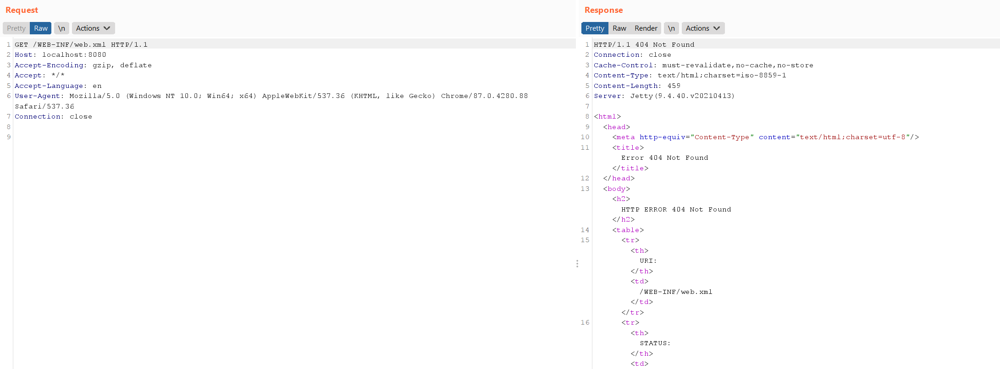
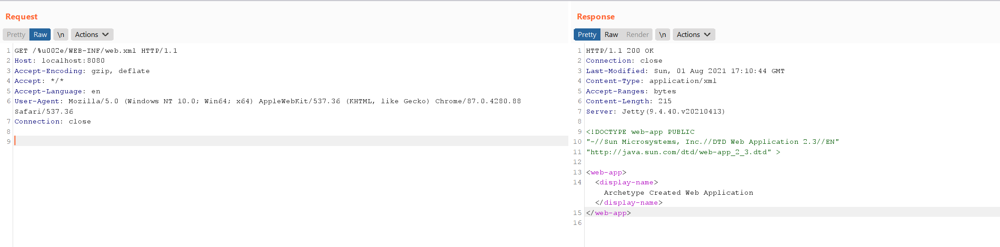

# Jetty WEB-INF 敏感信息泄露漏洞（CVE-2021-34429）

Eclipse Jetty 是一个开源的 servlet 容器，它为基于 Java 的 Web 容器提供运行环境。

Jetty 在 9.4.40 后修复了因为 `%2e` 导致的敏感信息泄露漏洞 [CVE-2021-28164](https://github.com/vulhub/vulhub/tree/master/jetty/CVE-2021-28164)，但这个修复是不完全的，通过下面三种方式可以进行绕过：

- unicode 形式 URL 编码：`/%u002e/WEB-INF/web.xml`
- `\0` 组合 `.` 导致的绕过：`/.%00/WEB-INF/web.xml`
- `\0` 组合 `..` 导致的绕过：`/a/b/..%00/WEB-INF/web.xml`

影响版本：9.4.37-9.4.42, 10.0.1-10.0.5, 11.0.1-11.0.5

参考链接：

- https://github.com/eclipse/jetty.project/security/advisories/GHSA-vjv5-gp2w-65vm
- https://xz.aliyun.com/t/10039

## 漏洞环境

执行如下命令启动一个 Jetty 9.4.40：

```
docker compose up -d
```

服务启动后，访问 `http://your-ip:8080` 可以查看到一个 example 页面。

## 漏洞复现

直接访问 `/WEB-INF/web.xml` 将会返回 404 页面：



使用 `/%u002e/WEB-INF/web.xml` 来绕过限制下载 web.xml：


