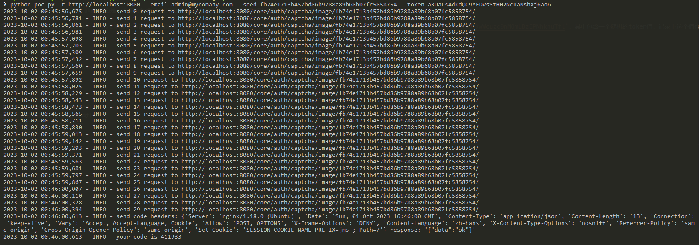

# Jumpserver随机数种子泄露导致账户劫持漏洞（CVE-2023-42820）

Jumpserver是一个开源堡垒机系统。在其3.6.4及以下版本中，存在一处账户接管漏洞。攻击者通过第三方库[django-simple-captcha](https://github.com/mbi/django-simple-captcha)泄露的随机数种子推算出找回密码时的用户Token，最终修改用户密码。

参考链接：

- <https://github.com/jumpserver/jumpserver/security/advisories/GHSA-7prv-g565-82qp>
- <https://mp.weixin.qq.com/s/VShjaDI1McerX843YyOENw>
<!-- - <https://www.leavesongs.com/PENETRATION/jumpserver-sep-2023-multiple-vulnerabilities-go-through.html> -->

## 漏洞环境

启动环境前，修改[config.env](config.env)中`DOMAINS`的值为你的IP和端口，如`DOMAINS=your-ip:8080`。

然后执行如下命令启动一个Jumpserver 3.6.3 的服务器：

```
docker compose up -d
```

启动服务需要等待一段时间，之后访问`http://your-ip:8080`即可查看到Jumpserver的登录页面。我们使用`admin`作为账号及密码即可登录，第一次登录管理员账号需要修改密码。

## 漏洞复现

我编写了一个非常简单的半自动化脚本来复现这个漏洞。由于是半自动化，严格按照如下步骤方可正确复现。

首先，在浏览器第一个Tab中打开忘记密码页面：`http://your-ip:8080/core/auth/password/forget/previewing/`，此时页面上将有一个验证码。

- 如果验证码中包含数字10，则请刷新验证码，因为我们的脚本暂时无法处理数字10
- 如果验证码中不包含数字10，则右键菜单中将该验证码在新Tab下打开

新Tab中验证码的URL类似于`http://your-ip:8080/core/auth/captcha/image/87b2723d404657c2294abfab908975ebb9da5468/`，其中包含该验证码的key（一串sha1 hash值），也就是后面伪随机数使用的种子，记录下这个值作为**seed**。

返回第一个Tab，**刷新页面**。刷新页面的目的是，不使用包含“种子”的验证码，因为这个种子将在后续步骤中使用到。

刷新页面后正确填写用户名和验证码后提交，跳转到验证码验证页面。此时这个页面的URL类似于`http://localhost:8080/core/auth/password/forgot/?token=sceOx7yWuAH9wWcuzc0nMQmLBzEPNhkhuTfl`，其中包含一个随机的token值，记录下这个值作为**token**。

执行我们的[脚本](poc.py)：

```
python poc.py -t http://localhost:8080 --email admin@mycomany.com --seed [seed] --token [token]
```

这个脚本需要传入4个参数：

- `-t` 指定目标Jumpserver服务器地址
- `--email` 指定待劫持用户的邮箱地址
- `--seed` 前面记下来的随机数种子（**seed**）
- `--token` 前面记下来的token值（**token**）

脚本执行后，将输出预测的code值：



回到浏览器中，输入该code提交，即可来到修改新密码页面，修改密码即可。

完整的复现过程请参考如下gif：


