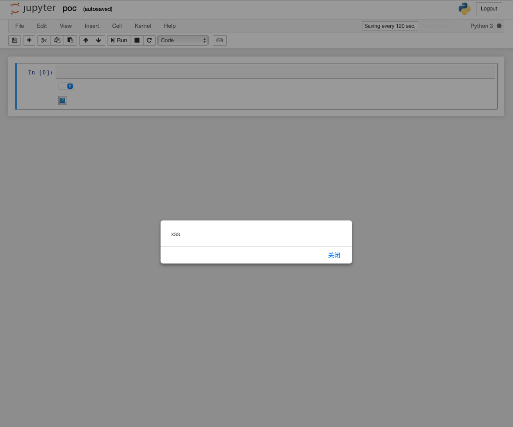

# Jupyter Notebook XSS (CVE-2021-32798)

Jupyter Notebook（此前被称为 IPython notebook）是一个交互式笔记本，支持运行 40 多种编程语言。

其在版本小于 6.4.1 或 5.7.11 时存在 XSS 漏洞，导致远程代码执行。

漏洞详情：

 - https://github.com/google/security-research/security/advisories/GHSA-c469-p3jp-2vhx
 - https://nvd.nist.gov/vuln/detail/CVE-2021-32798

## 环境运行

执行以下命令启动 Jupyter Notebook 5.2.2：

```
docker compose up -d
```

运行后，访问`http://your-ip:8888?token=vulhub`后将看到 `poc` 文件。

## 漏洞复现

直接点击 `poc` 文件即可看到 XSS 效果：



漏洞的核心原因是 Jupyter Notebook 使用到了存在漏洞的 Google Caja 组件。特定版本的 Google Caja 会受到 XSS 攻击。XSS 会允许攻击者使用 Jupyter 当成一个 API 来在受害者计算机上执行任意代码。
