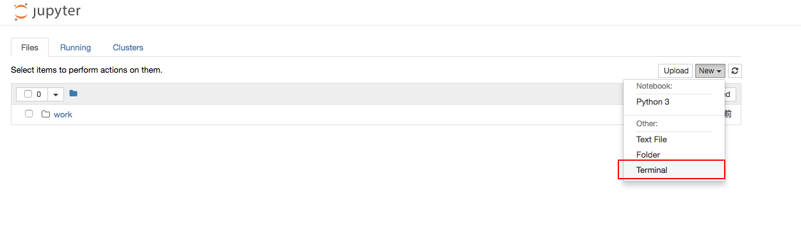
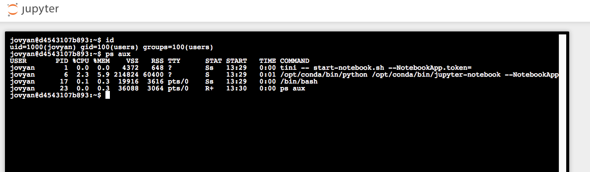

# Jupyter Notebook Unauthorized Access

[中文版本(Chinese version)](README.zh-cn.md)

The Jupyter Notebook (previous IPython notebook) is a web-based interactive computing platform.

If the administrator doesn't configure a password for Jupyter Notebook, this will lead to an unauthorized access vulnerability where attackers can create a console and execute arbitrary Python code and commands.

## Vulnerable environment

Execute following command to start a Jupyter Notebook server:

```
docker compose up -d
```

After the server is started, you can see the index of Jupyter Notebook on `http://your-ip:8888`.

## Vulnerability Reproduce

Click "New" -> "Terminal" to create a console:



Execute arbitrary commands in this console:


