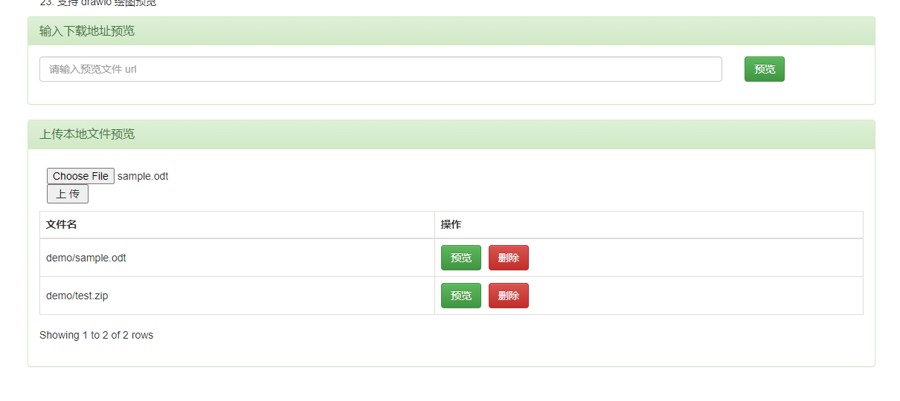
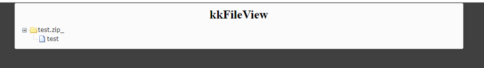
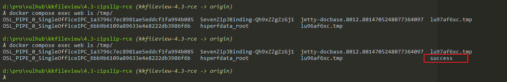

# kkFileView ZipSlip Remote Code Execution

[中文版本(Chinese version)](README.zh-cn.md)

kkFileView is an open source document online preview solution.

In the version prior to 4.4.0-beta, kkFileView has a ZipSlip issue. Attackers can use this issue to upload arbitrary files to the server and execute code.

References:

- <https://github.com/luelueking/kkFileView-v4.3.0-RCE-POC>

## Vulnerable environment

Execute following command to start a kkFileView 3.4.0:

```
docker compose up -d
```

After the server is started, you can see the index page at `http://your-ip:8012`.

## Exploit

First, generate a craft POC by [poc.py](poc.py):

```
python poc.py
```

A `test.zip` file will be written.

Upload `test.zip` and the [sample.odt](samople.odt) to the kkFileView server:



Then, click the "preview" button of `test.zip`, the zip file will be listed:



Finally, click the "preview" button of `sample.odt`.

You can see the `touch /tmp/success` has been executed successful:


