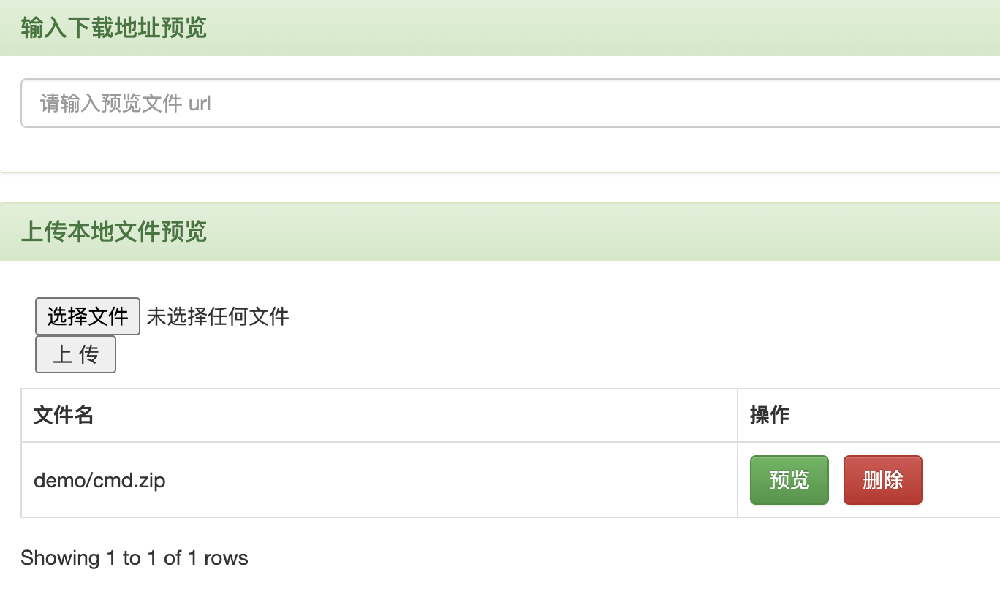

# kkFileView ZipSlip 远程命令执行漏洞

kkFileView是一个文档预览解决方案。

在kkFileView 4.4.0-beta以前，存在一处ZipSlip漏洞。攻击者可以利用该漏洞，向服务器任意目录下写入文件，导致任意命令执行漏洞。

参考链接：

- <https://github.com/luelueking/kkFileView-v4.3.0-RCE-POC>

## 漏洞环境

执行如下命令启动一个kkFileView 4.3.0服务器：

```
docker compose up -d
```

服务启动后，访问`http://your-ip:8012`即可查看到首页。

## 漏洞复现

### 执行命令

首先，修改并执行[poc.py](poc.py)，生成POC文件：

```
python poc.py
```

然后，`test.zip`将被写入到当前目录下。

上传`test.zip`和[sample.odt](sample.odt)两个文件到kkFileView服务中：


然后，点击`test.zip`的“预览”按钮，可以看到zip压缩包中的文件列表：


最后，点击`sample.odt`的“预览”按钮，触发代码执行漏洞。

可见，`touch /tmp/success`已经成功被执行：


### 注入内存马

首先，执行[cmd.py](cmd.py)，生成POC文件：

```
python cmd.py
```

然后，`cmd.zip`将被写入到当前目录下。

上传`cmd.zip`到kkFileView服务中：



然后，点击`cmd.zip`的“预览”按钮，可以看到zip压缩包中的文件列表：

再点击`sample.odt`，触发代码执行漏洞，注入内存马。


访问`http://your-ip:8012?cmd=whoami`获取命令执行结果。


