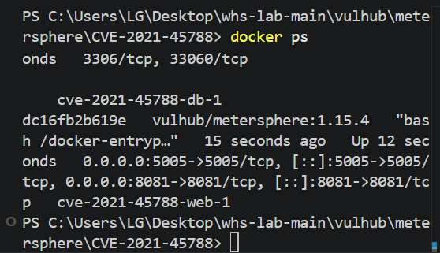
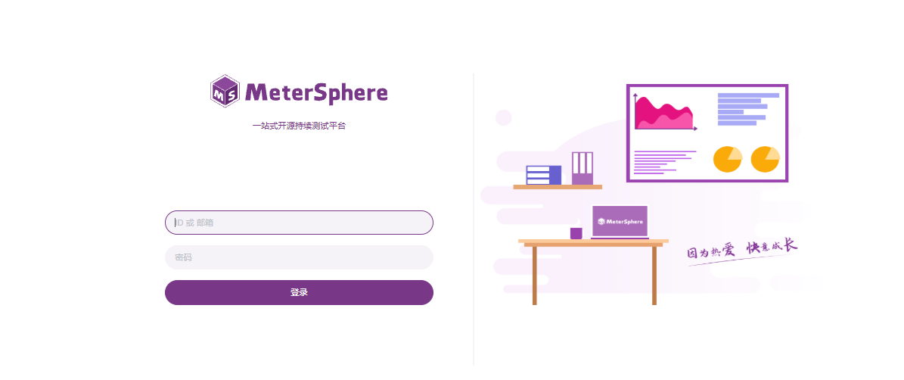
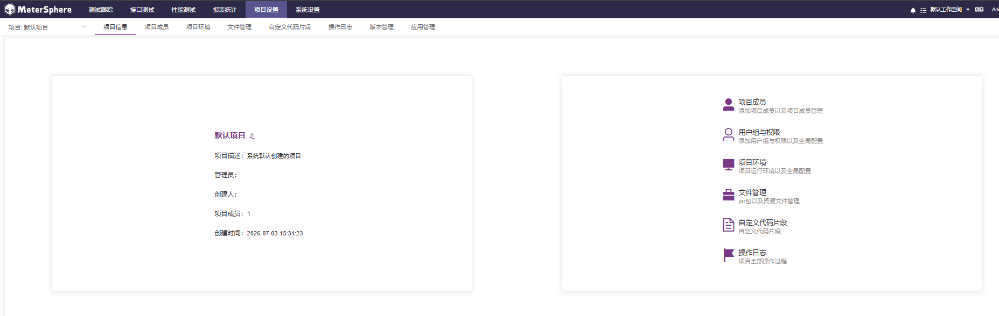
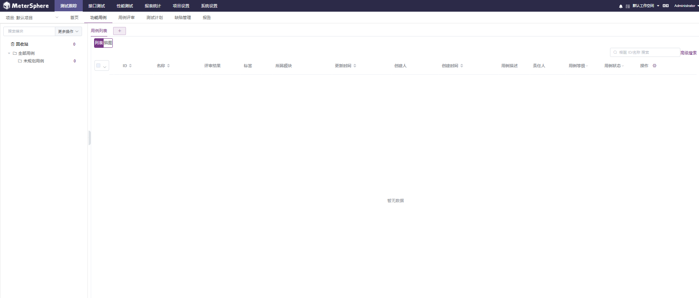
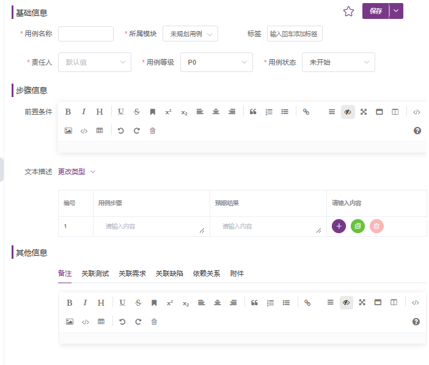
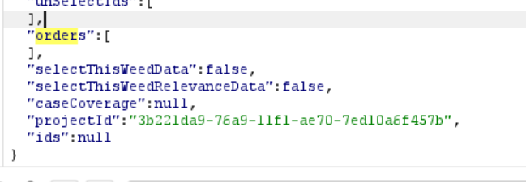
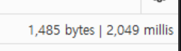

# MeterSphere v1.15.4 Authenticated SQL Injection (CVE-2021-45788)

## 1. 취약점 요약

이번 실습에서는 Vulhub에 있는 **MeterSphere CVE-2021-45788** 취약점을 Docker 환경에서 직접 구성하고 재현하였다.

MeterSphere는 테스트 관리와 API 테스트 등을 지원하는 오픈소스 테스트 플랫폼이다. 이 취약점은 **MeterSphere v1.15.4 이하 버전**의 테스트 케이스 관련 API에서 발생하는 SQL Injection 취약점이다.

취약점의 원인은 테스트 케이스 목록을 조회할 때 사용하는 `orders` 값이 안전하게 처리되지 않는 것이다. `orders`는 목록을 어떤 기준으로 정렬할지 정하는 값인데, 이 값에 SQL 구문이 섞여 들어가면 서버의 SQL 쿼리에 영향을 줄 수 있다.

이 실습에서는 실제 데이터를 조회하거나 삭제하는 공격은 하지 않았고, `sleep(2)`를 이용하여 응답 시간이 늦어지는지만 확인하였다. 이를 통해 SQL Injection이 가능한지 안전한 방식으로 확인하였다.

- 취약점 이름: MeterSphere v1.15.4 Authenticated SQL Injection
- CVE 번호: CVE-2021-45788
- 취약 버전: MeterSphere v1.15.4 이하
- 취약 파라미터: `orders`
- 취약점 종류: Time-based SQL Injection
- 인증 필요 여부: 필요

## 2. 환경 구성

실습 환경은 Vulhub에서 제공하는 Docker Compose 환경을 사용하였다. Docker Compose를 이용하면 필요한 컨테이너를 한 번에 실행할 수 있기 때문에 실습 환경을 쉽게 구성할 수 있었다.

### 사용 환경

- OS: Windows
- 도구: Docker Desktop, Docker Compose, Burp Suite, Chrome
- 실습 대상: MeterSphere v1.15.4
- 접속 주소: `http://localhost:8081`

### 실행 명령어

먼저 Vulhub 저장소에서 MeterSphere CVE-2021-45788 폴더로 이동하였다.

```bash
cd vulhub/metersphere/CVE-2021-45788
```

그 다음 Docker Compose로 취약 환경을 실행하였다.

```bash
docker compose up -d
```

컨테이너가 정상적으로 실행되었는지는 아래 명령어로 확인하였다.

```bash
docker ps
```

실행 결과 MeterSphere 컨테이너가 `Up` 상태이고, `8081` 포트가 열려 있는 것을 확인하였다.



## 3. 취약 조건

이 취약점은 로그인하지 않은 상태에서는 바로 재현할 수 없고, MeterSphere에 로그인한 사용자 권한이 필요하다. 따라서 먼저 기본 계정으로 로그인한 뒤 테스트 케이스 목록 화면으로 이동하였다.

사용한 로그인 정보는 다음과 같다.

```text
ID: admin
PW: metersphere
```

브라우저에서 `http://localhost:8081`로 접속하면 MeterSphere 로그인 화면이 출력된다.



로그인 후에는 프로젝트 화면이 정상적으로 표시되었다.



테스트 케이스 목록 API가 정상적으로 동작하려면 테스트 케이스 데이터가 필요하므로, 실습용 테스트 케이스를 하나 생성하였다. 테스트 케이스 이름은 `test`로 입력하고, 나머지 항목은 기본값을 사용하였다.





## 4. 재현 절차

재현 절차는 전체적으로 다음과 같이 진행하였다.

1. Docker Compose로 MeterSphere 취약 환경을 실행한다.
2. 브라우저에서 `http://localhost:8081`에 접속한다.
3. `admin / metersphere` 계정으로 로그인한다.
4. 테스트 추적 메뉴에서 기능用例 화면으로 이동한다.
5. 실습용 테스트 케이스 `test`를 생성한다.
6. Burp Suite를 이용하여 테스트 케이스 목록 조회 요청을 확인한다.
7. 요청 Body 안에 있는 `orders` 값을 조작한다.
8. `sleep(2)`를 넣은 뒤 응답 시간이 약 2초 지연되는지 확인한다.

## 5. PoC 코드

Burp Suite의 HTTP history에서 테스트 케이스 목록 조회 요청을 찾았다. 요청 Body 안에는 `orders` 값이 존재하였다.



기존 요청에서는 `orders` 값이 비어 있었다.

```json
"orders": []
```

PoC에서는 이 값을 아래와 같이 수정하였다.

```json
"orders": [
  {
    "name": "name",
    "type": ",if(1=1,sleep(2),0)"
  }
]
```

여기서 `sleep(2)`는 데이터베이스 응답을 약 2초 정도 지연시키는 역할을 한다. 실제 데이터를 가져오거나 변경하는 목적이 아니라, SQL 구문이 서버에서 처리되는지 확인하기 위해 사용하였다.

## 6. 실행 결과

PoC 요청을 Burp Suite Repeater에서 전송한 결과, 응답 시간이 약 2초 정도 지연되는 것을 확인하였다.

실제로 확인된 응답 시간은 약 **2,049ms**였다.



정상 요청보다 응답 시간이 길어진 것을 통해 `orders` 값이 SQL 쿼리에 영향을 줄 수 있다는 것을 확인하였다. 따라서 MeterSphere v1.15.4 환경에서 CVE-2021-45788 취약점이 재현되었다고 판단하였다.

## 7. 대응 방안

이 취약점을 막기 위해서는 다음과 같은 조치가 필요하다.

### 1) 최신 버전으로 업데이트

취약한 MeterSphere v1.15.4 이하 버전을 사용하는 경우, 취약점이 수정된 최신 버전으로 업데이트해야 한다. 알려진 취약점은 패치된 버전을 사용하는 것이 가장 기본적인 대응 방법이다.

### 2) 입력값 검증

`orders`처럼 사용자가 전달할 수 있는 값은 서버에서 허용된 값인지 확인해야 한다. 예를 들어 정렬 기준은 `name`, `id`, `create_time`처럼 미리 정해둔 값만 사용할 수 있도록 제한하는 것이 좋다.

### 3) Prepared Statement 사용

SQL 쿼리를 문자열로 직접 이어 붙이는 방식은 위험하다. 사용자 입력값이 SQL 구문으로 해석되지 않도록 Prepared Statement 또는 안전한 ORM 방식을 사용해야 한다.

### 4) 권한 관리

이 취약점은 인증된 사용자가 접근할 수 있는 기능에서 발생한다. 따라서 사용자 권한을 최소한으로 부여하고, 불필요한 계정이나 권한은 제거하는 것이 좋다.

### 5) 로그 모니터링

`sleep`, `if`, `union`, `select` 같은 의심스러운 문자열이 포함된 요청이 반복적으로 들어오는지 로그를 통해 확인할 필요가 있다.

## 8. Risk Score

이 취약점은 인증이 필요하지만, 네트워크를 통해 원격으로 공격할 수 있고 SQL Injection을 통해 데이터베이스에 영향을 줄 수 있다. 또한 데이터 조회, 변조, 서비스 지연 등의 위험이 생길 수 있다.

CVSS 기준으로는 **8.8 / 10.0 High** 수준으로 판단하였다.

- Attack Vector: Network
- Attack Complexity: Low
- Privileges Required: Low
- User Interaction: None
- Scope: Unchanged
- Confidentiality: High
- Integrity: High
- Availability: High

따라서 Risk Score는 다음과 같이 정리하였다.

```text
Risk Score: 8.8 / 10.0 (High)
```

## 9. 정리

이번 실습을 통해 Docker Compose를 이용하여 취약한 MeterSphere 환경을 직접 실행해 보았다. 처음에는 Docker Desktop이 실행되지 않아 컨테이너 연결 오류가 발생했지만, Docker Desktop을 실행한 뒤 정상적으로 환경을 구성할 수 있었다.

이후 MeterSphere에 로그인하고 테스트 케이스를 생성한 뒤, Burp Suite를 이용하여 테스트 케이스 목록 조회 요청을 확인하였다. `orders` 값에 `sleep(2)`를 넣어 요청했을 때 응답 시간이 약 2초 지연되는 것을 확인하였고, 이를 통해 CVE-2021-45788 취약점을 재현할 수 있었다.

이번 실습으로 SQL Injection이 단순히 로그인 화면에서만 발생하는 것이 아니라, 정렬 조건이나 목록 조회 API 같은 부분에서도 발생할 수 있다는 점을 알게 되었다. 또한 사용자 입력값을 서버에서 안전하게 검증하는 것이 중요하다는 것을 확인하였다.

## 10. 참고 자료

- Vulhub MeterSphere CVE-2021-45788 README: https://github.com/vulhub/vulhub/tree/master/metersphere/CVE-2021-45788
- NVD CVE-2021-45788: https://nvd.nist.gov/vuln/detail/CVE-2021-45788
- MeterSphere GitHub Issue: https://github.com/metersphere/metersphere/issues/8651
