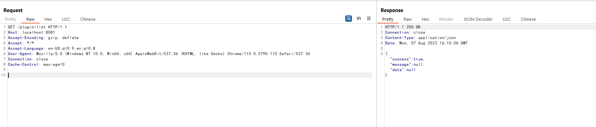

# MeterSphere Plugin Endpoint Remote Code Execution

[中文版本(Chinese version)](README.zh-cn.md)

MeterSphere is a one-stop open source continuous testing platform under the GPL v3 open source license.

In the version v1.16.3 and before, MeterSphere's plugin API is unauthenticated and the attackers are able to upload plugins to the server and execute arbitrary code.

References:

- <https://xz.aliyun.com/t/10772>

## Vulnerable environment

Execute following command to start a MeterSphere server v1.16.3:

```
docker compose up -d
```

After the server is fully initialized, you can see the login page of MeterSphere on `http://your-ip:8081`.

## Exploit

Firstly, by visiting `http://your-ip:8081/plugin/list`, you can see that the success message is returned without being redirected to the login page, indicating that the plugin API can be accessed without authorization.




